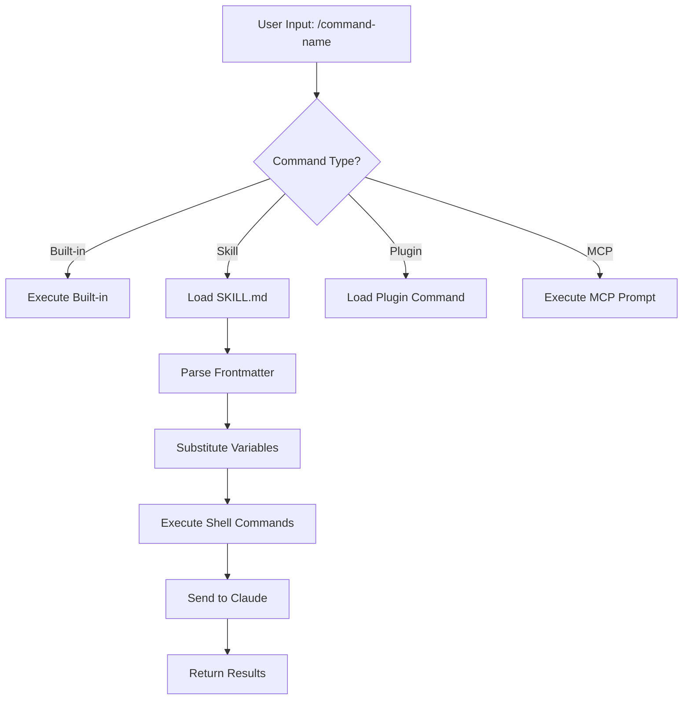
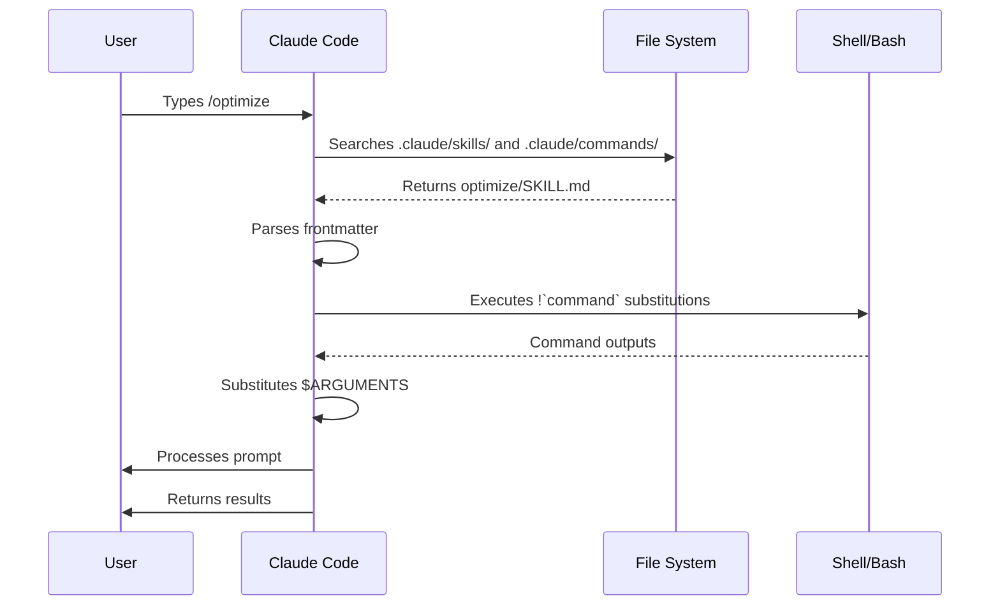

<picture>
  <source media="(prefers-color-scheme: dark)" srcset="../resources/logos/claude-howto-logo-dark.svg">
  
</picture>

# Slash Commands

## Overview

Slash commands are shortcuts that control Claude's behavior during an interactive session. They come in several types:

- **Built-in commands**: Provided by Claude Code (`/help`, `/clear`, `/model`)
- **Skills**: User-defined commands created as `SKILL.md` files (`/optimize`, `/pr`)
- **Plugin commands**: Commands from installed plugins (`/frontend-design:frontend-design`)
- **MCP prompts**: Commands from MCP servers (`/mcp__github__list_prs`)

> **Note**: Custom slash commands have been merged into skills. Files in `.claude/commands/` still work, but skills (`.claude/skills/`) are now the recommended approach. Both create `/command-name` shortcuts. See the [Skills Guide](../03-skills/) for the full reference.

## Built-in Commands Reference

Built-in commands are shortcuts for common actions. There are **60+ built-in commands** and **10 bundled skills** available. Type `/` in Claude Code to see the full list, or type `/` followed by any letters to filter.

> **Note**: Since v2.1.236, pressing Enter on a mistyped slash command — or on a command that is not available in the current session — reports an error instead of silently running the closest fuzzy match. Unambiguous prefixes and defined aliases still run as before.

| Command | Purpose |
|---------|---------|
| `/add-dir <path>` | Add working directory |
| `/advisor [model\|off]` | Configure the advisor. Opens as an interactive dialog; in the desktop app, Remote Control, and headless (`-p` / Agent SDK) sessions it takes a text form instead — bare `/advisor`, `/advisor <model>`, or `/advisor off` (v2.1.260+) |
| `/agents` | Manage agent configurations |
| `/branch [name]` | Switch into a copy of the conversation at this point, preserving the original (return to it with `/resume`) |
| `/fork [prompt]` | Copy the current conversation into a new **background session** and keep working here; the two are independent from that point on and the copy gets its own row in `claude agents` (v2.1.212+). Except when the copy edits in place, Claude Code instructs it to create a worktree of its own before making code changes (isolation instruction requires v2.1.221+) |
| `/subtask <task>` | Spawn a **forked subagent** that inherits the full conversation and works on the task while you keep going; its result returns to this conversation when it finishes (v2.1.212+) |
| `/btw <question>` | Ask an ephemeral side question while Claude is working on the main task; doesn't pollute the main conversation context |
| `/cd <path>` | Move the session to a new working directory without breaking the prompt cache (added v2.1.169) |
| `/chrome` | Configure Chrome browser integration |
| `/clear` | Clear conversation (aliases: `/reset`, `/new`) |
| `/color [color\|default]` | Set prompt bar color. Bare `/color` (no args) picks a random session color (v2.1.128+); pass a color name or hex to set explicitly. |
| `/compact [instructions]` | Compact conversation with optional focus instructions. A failed compact now displays as an error in the UI instead of silently doing nothing (v2.1.216) |
| `/config` | Open Settings (alias: `/settings`) |
| `/context` | Visualize context usage as colored grid. Shows an explicit warning when usage is over the context window limit (v2.1.216) |
| `/copy [N]` | Copy assistant response to clipboard; `w` writes to file |
| `/cost` | Typing-shortcut alias for `/usage` — opens the cost tab (v2.1.118+) |
| `/desktop` | Continue in Desktop app (alias: `/app`) |
| `/diff` | Interactive diff viewer for uncommitted changes. In fullscreen rendering it instead opens a diff panel beside the conversation that stays open while you keep working — it lists changed files with added/removed line counts and refreshes every time Claude edits a file or runs a shell command; run `/diff` again or click `✕` to close it (v2.1.260+). The classic renderer opens the viewer in place of the prompt |
| `/doctor` | Diagnose installation health — openable while Claude is responding; shows status icons; press `f` to auto-fix issues (enhanced in v2.1.116; layout refreshed to a flat tree with clearer icons in v2.1.178) |
| `/effort [low\|medium\|high\|xhigh\|max\|auto]` | Set effort level via interactive arrow-key slider. Levels: `low` → `medium` → `high` → `xhigh` (new in v2.1.111) → `max`. Default is `high` on Opus 5, Sonnet 5, and Opus 4.8 (`xhigh` on Opus 4.7); `xhigh` needs Opus 5, Sonnet 5, Opus 4.8, or Opus 4.7; `max` works on Opus 5, Sonnet 5, Opus 4.8/4.7/4.6 and Sonnet 4.6. The menu also offers `ultracode` (not a model effort level — it sends `xhigh` and has Claude orchestrate dynamic workflows; session-only) |
| `/exit` | Exit the REPL (alias: `/quit`) |
| `/export [filename]` | Export the current conversation to a file or clipboard |
| `/usage-credits` | Configure extra usage for rate limits (renamed from `/extra-usage` in v2.1.144; `/extra-usage` still works as an alias) |
| `/fast [on\|off]` | Toggle fast mode. Applies to Opus 5 and Opus 4.8 (v2.1.219) |
| `/feedback` | Submit feedback (alias: `/bug`). Since v2.1.141, can attach recent sessions (last 24h or 7d) so reports spanning more than one session include context. As of v2.1.178, `/bug` requires a description before it can be submitted. |
| `/focus` | Toggle focus view (added v2.1.110; replaces `Ctrl+O` for focus toggle) |
| `/goal <statement>` | Register a session-level completion condition; Claude keeps working until the goal is met. `/goal clear` removes it. Active goal appears in the status line, with a live overlay panel showing elapsed time, turn count, and token usage (added v2.1.139). |
| `/help` | Show help |
| `/hooks` | View hook configurations |
| `/ide` | Manage IDE integrations |
| `/init` | Initialize `CLAUDE.md`. Set `CLAUDE_CODE_NEW_INIT=1` for interactive flow |
| `/insights` | Generate session analysis report |
| `/install-github-app` | Set up GitHub Actions app |
| `/install-slack-app` | Install Slack app |
| `/keybindings` | Open keybindings configuration |
| `/fewer-permission-prompts` | Analyze recent Bash/MCP tool calls and add a prioritized allowlist to `.claude/settings.json` to reduce permission prompts (added v2.1.111) |
| `/login` | Switch Anthropic accounts |
| `/logout` | Sign out from your Anthropic account |
| `/mcp` | Manage MCP servers and OAuth |
| `/memory` | Edit `CLAUDE.md`, toggle auto-memory |
| `/mobile` | QR code for mobile app (aliases: `/ios`, `/android`) |
| `/model [model]` | Select model with left/right arrows for effort. Since v2.1.153, the choice is **saved as the default** for new sessions (matching the IDE); press `s` after selecting to apply it to the current session only. (The keybinding `modelPicker:setAsDefault` was renamed to `modelPicker:thisSessionOnly`; the old `d` action is now `s`.) As of v2.1.219, the picker shows the merged Opus row as "Opus (1M context)". |
| `/passes` | Share free week of Claude Code |
| `/permissions` | View/update permissions (alias: `/allowed-tools`) |
| `/plan [description]` | Enter plan mode |
| `/plugin` | Manage plugins |
| `/proactive` | Alias for `/loop` (added v2.1.105) |
| `/powerup` | Discover features through interactive lessons with animated demos |
| `/privacy-settings` | Privacy settings (Pro/Max only) |
| `/release-notes` | View changelog |
| `/recap` | Show session recap / summary when returning to a session (added v2.1.108) |
| `/reload-plugins` | Reload active plugins. Since v2.1.221 most installs activate immediately, so this is only needed when the install summary says `Run /reload-plugins to activate.` Available in headless sessions as of v2.1.260, so it also appears in the Claude Code Desktop and SDK command lists |
| `/reload-skills` | Re-scan skill directories without restarting the session (added v2.1.152) |
| `/remote-control` | Remote control from claude.ai (alias: `/rc`) |
| `/remote-env` | Configure default remote environment |
| `/rename [name]` | Rename session |
| `/resume [session]` | Resume conversation (alias: `/continue`) |
| `/review [low\|medium\|high\|xhigh\|max\|ultra] [--fix] [--comment] [pr#\|branch\|path]` | Alias of `/code-review` (v2.1.223): reviews the current diff, or a PR number, branch, or path you pass — e.g. `/review 1234`. Takes the same effort levels and flags. With no level given, it reuses the last `low`–`max` level you typed |
| `/rewind` | Rewind conversation and/or code (alias: `/checkpoint`) |
| `/sandbox` | Toggle sandbox mode |
| `/schedule [description]` | Create/manage Cloud scheduled tasks |
| `/scroll-speed <+N\|-N>` | Tune mouse-wheel scroll speed of the TUI live-preview pane with a live preview. Persists per-machine to `~/.claude/preferences.json` (added v2.1.139). |
| `/security-review` | Analyze branch for security vulnerabilities |
| `/skill-doctor` | Show which loaded skills go unused and what each one costs in context, so you can decide which to turn off. The report opens in the `/plugin` manager's **Stats** tab; in non-interactive `-p` mode it prints as text. Over Remote Control it replies `Skill usage reports are not available on this connection.` — run it in the terminal on the machine hosting the session (requires v2.1.252+) |
| `/skills` | List available skills |
| `/stats` | Typing-shortcut alias for `/usage` — opens the stats tab (daily usage, sessions, streaks) (v2.1.118+) |
| `/stickers` | Order Claude Code stickers |
| `/status` | Show version, model, account, and a `Session kind` row reading `background job · attached`, `background job · unattended`, or `interactive` (row added v2.1.221). Openable while Claude is responding |
| `/statusline` | Configure status line |
| `/tasks` | List/manage background tasks |
| `/team-onboarding` | Generate a teammate ramp-up guide from the project's Claude Code setup (new in v2.1.101) |
| `/teleport` | Resume a Claude Code on the web session in this terminal; opens a picker of your web sessions (alias: `/tp`). Requires a claude.ai subscription |
| `/terminal-setup` | Configure terminal keybindings |
| `/theme` | Open theme picker / manage custom themes (v2.1.118). Define custom themes via JSON in `~/.claude/themes/<name>.json` |
| `/tui` | Toggle fullscreen TUI (text user interface) mode with flicker-free rendering (added v2.1.110) |
| `/ultrareview` | Comprehensive cloud-based multi-agent code review (added v2.1.111). The preferred invocation is now `/code-review ultra`; `/ultrareview` remains as an alias. Includes 3 free runs on Pro and Max, then requires usage credits |
| `/upgrade` | Open upgrade page for higher plan tier |
| `/usage` | Canonical usage dashboard (v2.1.118) — combines plan usage limits, rate limits, cost, and daily session stats. `/cost` and `/stats` are typing-shortcut aliases that open specific tabs |
| `/voice` | Toggle push-to-talk voice dictation |
| `/workflows` | View running and completed dynamic workflow runs (added v2.1.154). See [Dynamic Workflows](../09-advanced-features/README.md#dynamic-workflows) |

> **Why `/cd` matters:** changing directories used to lose cache warmth (making the next turn slower and costlier); `/cd` preserves the prompt cache across the switch.

### Bundled Skills

These skills ship with Claude Code and are invoked like slash commands:

| Skill | Purpose |
|-------|---------|
| `/batch <instruction>` | Orchestrate large-scale parallel changes using worktrees |
| `/claude-api` | Load Claude API reference for project language |
| `/dataviz` | Chart and dashboard design guidance with a runnable color-palette validator (v2.1.198) |
| `/debug [description]` | Enable debug logging |
| `/design [description]` | Create a **design canvas** — a multi-artboard visual design (UI mockups, screen flows, landing pages, posters) published as an artifact and refined visually rather than in code. Use it instead of hand-writing HTML when the layout is what you want to iterate on. Research preview; requires v2.1.233+ and a Pro, Max, Team, or Enterprise plan |
| `/loop [interval] <prompt>` | Run prompt repeatedly on interval |
| `/code-review [low\|medium\|high\|xhigh\|max\|ultra] [--fix] [--comment] [pr#\|branch\|path]` | Review the current diff — or a PR number, branch, or path you pass — for correctness bugs. Pass `--fix` to apply findings, `--comment` to post them as inline GitHub PR comments, or `ultra` to run a deep cloud review; with `ultra` on a `github.com` PR target, `--post` preselects posting the findings to the PR. With no effort level given, the review reuses the last level you typed (v2.1.223). Originally absorbed `/simplify` in v2.1.146, but `/simplify` returned as a distinct command in v2.1.154 |
| `/simplify` | Run a cleanup-only review (reuse / simplification / efficiency / altitude) and apply the fixes; does **not** hunt for bugs — use `/code-review` for that. Briefly an alias of `/code-review --fix` (v2.1.152), it became cleanup-only in v2.1.154 |

### Deprecated Commands

| Command | Status |
|---------|--------|
| `/output-style` | Removed in v2.1.91 (deprecated v2.1.73) — use `/config` → Output style, or the `outputStyle` setting |
| `/pr-comments` | Removed in v2.1.91 — ask Claude directly to view PR comments |
| `/vim` | Removed in v2.1.92 — use /config → Editor mode |
| `/undo` | No longer listed in the official commands reference as of v2.1.245 (it was added as an alias for `/rewind` in v2.1.108) — use `/rewind` or press `Esc` twice |

### Recent Changes

- `/fork` and `/subtask` swapped roles in **v2.1.212**. `/fork` now copies the conversation into a new independent background session; the forked-subagent behavior it used to have moved to the new `/subtask` command. History: `/fork` was an alias for `/branch` from v2.1.77 to v2.1.161; from v2.1.161 to v2.1.211 it started a forked subagent (what `/subtask` does now). When agent view is turned off, `/subtask` is unavailable and `/fork` keeps the forked-subagent behavior
- `/resume` (no arguments) opens a picker of past sessions — including ones removed from the visible list — and resumes the chosen one as a background session (v2.1.212)
- `/output-style` deprecated (v2.1.73) and removed (v2.1.91) — output styles are still available via `/config` → Output style or the `outputStyle` setting; the built-ins are Default, Proactive, Explanatory, Learning, and Concise (added in v2.1.237)
- `/review` became a full alias of `/code-review` — same targets, effort levels, and flags (v2.1.223). History: it first moved onto the `/code-review medium` engine in v2.1.186 while remaining PR-only
- `/effort` command added; `max` level available on Opus 4.6+ (originally Opus 4.6-only)
- `/voice` command added for push-to-talk voice dictation
- `/schedule` command added for creating/managing scheduled tasks
- `/color` command added for prompt bar customization
- /pr-comments removed in v2.1.91 — ask Claude directly to view PR comments
- /vim removed in v2.1.92 — use /config → Editor mode instead
- `/ultraplan` was removed in v2.1.222 — use plan mode instead
- /powerup added for interactive feature lessons
- /sandbox added for toggling sandbox mode
- `/model` picker now shows human-readable labels (e.g., "Sonnet 4.6") instead of raw model IDs
- `/resume` supports `/continue` alias
- MCP prompts are available as `/mcp__<server>__<prompt>` commands (see [MCP Prompts as Commands](#mcp-prompts-as-commands))
- `/team-onboarding` added for auto-generating teammate ramp-up guides (v2.1.101)
- `/tui` command added for flicker-free fullscreen TUI rendering (v2.1.110)
- `/focus` command added for focus view toggle; `Ctrl+O` now only toggles verbose transcript (v2.1.110)
- `/recap` command added to manually trigger session context recap (v2.1.108)
- `/undo` added as alias for `/rewind` (v2.1.108); it no longer appears in the official commands reference as of v2.1.245 — use `/rewind` or `Esc Esc`
- `/proactive` added as alias for `/loop` (v2.1.105)
- `/effort` gained interactive arrow-key slider and new `xhigh` level between `high` and `max`; default effort raised to `xhigh` for Opus 4.7 plans (v2.1.111). On Opus 4.8 the default is `high` (v2.1.154); Opus 5 also defaults to `high` (v2.1.219)
- `/ultrareview` added for comprehensive cloud-based multi-agent code review (v2.1.111)
- `/fewer-permission-prompts` added to analyze Bash/MCP tool calls and reduce permission prompts via an allowlist in `.claude/settings.json` (v2.1.111)
- Auto mode no longer requires the `--enable-auto-mode` flag for Max subscribers on Opus 4.7 (v2.1.112)
- `/goal` added — session-level completion condition that Claude works toward across turns; live overlay shows elapsed time, turn count, and token usage (v2.1.139)
- `/scroll-speed` added — tune mouse-wheel scroll speed of the TUI live-preview pane; persists per-machine (v2.1.139)
- `/reload-skills` added — re-scan skill directories without restarting the session (v2.1.152)
- `/model` now saves the selected model as the default for new sessions; press `s` for session-only (keybinding `modelPicker:setAsDefault` → `modelPicker:thisSessionOnly`) (v2.1.153)
- `/workflows` added — view running and completed dynamic workflow runs (v2.1.154)
- `/simplify` returned as a distinct cleanup-only review command (reuse / simplification / efficiency / altitude), separate from `/code-review`'s bug hunt (v2.1.154)
- `/status` gained a `Session kind` row distinguishing attached and unattended background jobs from interactive sessions (v2.1.221)
- Plugin installs now activate immediately when it is safe to do so; `/reload-plugins` is only needed when the install summary asks for it (v2.1.221)
- `/ultraplan` removed — use plan mode (v2.1.222)
- `/code-review` and `/review` remember the last effort level you typed when you omit one (v2.1.223)
- `/code-review ultra` became the preferred entry point for cloud multi-agent review; `/ultrareview` stays as an alias (v2.1.223)
- `/code-review` at `high`, `xhigh`, and `max` effort now runs in a background agent like the other levels (v2.1.232)
- The startup tip suggesting you create custom subagents, and the matching nudge in the `/powerup` tour, were removed (v2.1.232)
- `/permissions` can now be opened while Claude is working — rule changes apply to the rest of the current turn (v2.1.234)
- `/add-dir <path>` can now be used while Claude is working; the `/add-dir`, `/autocompact`, `/theme`, `/help`, `/config`, and `/advisor` dialogs open mid-turn **in the fullscreen TUI**, instead of queuing until Claude finishes responding (`/bug` already opened immediately, since v2.1.232) (v2.1.234)

### `/goal` — Session-Level Completion Condition

> **New in v2.1.139**

Use `/goal` to register a completion condition for the current session. Claude works toward it across turns, and an overlay panel shows elapsed time, turn count, and tokens used. Clear it with `/goal clear`. Works in interactive mode, `claude -p`, and Remote Control.

```
User: /goal Migrate the payments service from REST to gRPC and get the integration tests passing.
Claude: Goal registered. I'll work toward this until you clear it.
[Goal panel: ⏱ 0s · turns 0 · tokens 0]

User: start by listing the REST endpoints
Claude: [does the work, panel updates]
```

**Check-in on stalled background tasks (v2.1.234):** while a goal is active, if a background task makes no progress for 30+ minutes, Claude checks in with a status update instead of silently continuing. Tune the threshold (in minutes) with the `CLAUDE_CODE_GOAL_CHECKIN_MINUTES` environment variable, or set it to `0` to disable check-ins entirely.

### `/team-onboarding` — Teammate Ramp-Up Guide

> **New in v2.1.101**

Use `/team-onboarding` to generate a teammate ramp-up guide from your project's local Claude Code usage. The command inspects your `CLAUDE.md`, installed skills, subagents, hooks, and recent workflows, then produces an onboarding document that helps new developers become productive quickly.

It's a built-in command — nothing to install.

**Usage:**

```bash
claude /team-onboarding
```

The generated guide summarizes:

- Project purpose and key conventions from [`CLAUDE.md`](../02-memory/README.md)
- Available [skills](../03-skills/README.md) and when they are auto-invoked
- Configured [subagents](../04-subagents/README.md) and their responsibilities
- [Hooks](../06-hooks/README.md) that run on common events
- Common workflows newcomers should know about

**Availability:** Shipped in Claude Code v2.1.101 (April 11, 2026).

## Custom Commands (Now Skills)

Custom slash commands have been **merged into skills**. Both approaches create commands you can invoke with `/command-name`:

| Approach | Location | Status |
|----------|----------|--------|
| **Skills (Recommended)** | `.claude/skills/<name>/SKILL.md` | Current standard |
| **Legacy Commands** | `.claude/commands/<name>.md` | Still works |

If a skill and a command share the same name, the **skill takes precedence**. For example, when both `.claude/commands/review.md` and `.claude/skills/review/SKILL.md` exist, the skill version is used.

### Migration Path

Your existing `.claude/commands/` files continue to work without changes. To migrate to skills:

**Before (Command):**
```
.claude/commands/optimize.md
```

**After (Skill):**
```
.claude/skills/optimize/SKILL.md
```

### Why Skills?

Skills offer additional features over legacy commands:

- **Directory structure**: Bundle scripts, templates, and reference files
- **Auto-invocation**: Claude can trigger skills automatically when relevant
- **Invocation control**: Choose whether users, Claude, or both can invoke
- **Subagent execution**: Run skills in isolated contexts with `context: fork`
- **Progressive disclosure**: Load additional files only when needed

### Creating a Custom Command as a Skill

Create a directory with a `SKILL.md` file:

```bash
mkdir -p .claude/skills/my-command
```

**File:** `.claude/skills/my-command/SKILL.md`

```yaml
---
name: my-command
description: What this command does and when to use it
---

# My Command

Instructions for Claude to follow when this command is invoked.

1. First step
2. Second step
3. Third step
```

### Frontmatter Reference

| Field | Purpose | Default |
|-------|---------|---------|
| `name` | Command name (becomes `/name`) | Directory name |
| `description` | Brief description (helps Claude know when to use it) | First paragraph |
| `argument-hint` | Expected arguments for auto-completion | None |
| `allowed-tools` | Tools the command can use without permission | Inherits |
| `model` | Specific model to use | Inherits |
| `disable-model-invocation` | If `true`, only user can invoke (not Claude) | `false` |
| `user-invocable` | If `false`, hide from `/` menu | `true` |
| `context` | Set to `fork` to run in isolated subagent | None |
| `agent` | Agent type when using `context: fork` | `general-purpose` |
| `hooks` | Skill-scoped hooks (PreToolUse, PostToolUse, Stop) | None |

### Arguments

Commands can receive arguments:

**All arguments with `$ARGUMENTS`:**

```yaml
---
name: fix-issue
description: Fix a GitHub issue by number
---

Fix issue #$ARGUMENTS following our coding standards
```

Usage: `/fix-issue 123` → `$ARGUMENTS` becomes "123"

**Individual arguments with `$0`, `$1`, etc.:**

```yaml
---
name: review-pr
description: Review a PR with priority
---

Review PR #$0 with priority $1
```

Usage: `/review-pr 456 high` → `$0`="456", `$1`="high"

`${CLAUDE_PROJECT_DIR}` resolves to the absolute path of the project root (v2.1.196).

### Dynamic Context with Shell Commands

Execute bash commands before the prompt using `` !`command` ``:

```yaml
---
name: commit
description: Create a git commit with context
allowed-tools: Bash(git *)
---

## Context

- Current git status: !`git status`
- Current git diff: !`git diff HEAD`
- Current branch: !`git branch --show-current`
- Recent commits: !`git log --oneline -5`

## Your task

Based on the above changes, create a single git commit.
```

### File References

Include file contents using `@`:

```markdown
Review the implementation in @src/utils/helpers.js
Compare @src/old-version.js with @src/new-version.js
```

## Plugin Commands

Plugins can provide custom commands:

```
/plugin-name:command-name
```

Or simply `/command-name` when there are no naming conflicts.

**Examples:**
```bash
/frontend-design:frontend-design
/commit-commands:commit
```

## MCP Prompts as Commands

MCP servers can expose prompts as slash commands:

```
/mcp__<server-name>__<prompt-name> [arguments]
```

**Examples:**
```bash
/mcp__github__list_prs
/mcp__github__pr_review 456
/mcp__jira__create_issue "Bug title" high
```

### MCP Permission Syntax

Control MCP server access in permissions:

- `mcp__github` - Access entire GitHub MCP server
- `mcp__github__*` - Wildcard access to all tools
- `mcp__github__get_issue` - Specific tool access

## Command Architecture



## Command Lifecycle



## Available Commands in This Folder

These example commands can be installed as skills or legacy commands.

### 1. `/optimize` - Code Optimization

Analyzes code for performance issues, memory leaks, and optimization opportunities.

**Usage:**
```
/optimize
[Paste your code]
```

### 2. `/pr` - Pull Request Preparation

Guides through PR preparation checklist including linting, testing, and commit formatting.

**Usage:**
```
/pr
```

**Screenshot:**


### 3. `/generate-api-docs` - API Documentation Generator

Generates comprehensive API documentation from source code.

**Usage:**
```
/generate-api-docs
```

### 4. `/commit` - Git Commit with Context

Creates a git commit with dynamic context from your repository.

**Usage:**
```
/commit [optional message]
```

### 5. `/push-all` - Stage, Commit, and Push

Stages all changes, creates a commit, and pushes to remote with safety checks.

**Usage:**
```
/push-all
```

**Safety Checks:**
- Secrets: `.env*`, `*.key`, `*.pem`, `credentials.json`
- API Keys: Detects real keys vs. placeholders
- Large files: `>10MB` without Git LFS
- Build artifacts: `node_modules/`, `dist/`, `__pycache__/`

### 6. `/doc-refactor` - Documentation Restructuring

Restructures project documentation for clarity and accessibility.

**Usage:**
```
/doc-refactor
```

### 7. `/setup-ci-cd` - CI/CD Pipeline Setup

Implements pre-commit hooks and GitHub Actions for quality assurance.

**Usage:**
```
/setup-ci-cd
```

### 8. `/unit-test-expand` - Test Coverage Expansion

Increases test coverage by targeting untested branches and edge cases.

**Usage:**
```
/unit-test-expand
```

## Installation

### As Skills (Recommended)

Copy to your skills directory:

```bash
# Create skills directory
mkdir -p .claude/skills

# For each command file, create a skill directory
for cmd in optimize pr commit; do
  mkdir -p .claude/skills/$cmd
  cp 01-slash-commands/$cmd.md .claude/skills/$cmd/SKILL.md
done
```

### As Legacy Commands

Copy to your commands directory:

```bash
# Project-wide (team)
mkdir -p .claude/commands
cp 01-slash-commands/*.md .claude/commands/

# Personal use
mkdir -p ~/.claude/commands
cp 01-slash-commands/*.md ~/.claude/commands/
```

## Creating Your Own Commands

### Skill Template (Recommended)

Create `.claude/skills/my-command/SKILL.md`:

```yaml
---
name: my-command
description: What this command does. Use when [trigger conditions].
argument-hint: [optional-args]
allowed-tools: Bash(npm *), Read, Grep
---

# Command Title

## Context

- Current branch: !`git branch --show-current`
- Related files: @package.json

## Instructions

1. First step
2. Second step with argument: $ARGUMENTS
3. Third step

## Output Format

- How to format the response
- What to include
```

### User-Only Command (No Auto-Invocation)

For commands with side effects that Claude shouldn't trigger automatically:

```yaml
---
name: deploy
description: Deploy to production
disable-model-invocation: true
allowed-tools: Bash(npm *), Bash(git *)
---

Deploy the application to production:

1. Run tests
2. Build application
3. Push to deployment target
4. Verify deployment
```

## Best Practices

| Do | Don't |
|------|---------|
| Use clear, action-oriented names | Create commands for one-time tasks |
| Include `description` with trigger conditions | Build complex logic in commands |
| Keep commands focused on single task | Hardcode sensitive information |
| Use `disable-model-invocation` for side effects | Skip the description field |
| Use `!` prefix for dynamic context | Assume Claude knows current state |
| Organize related files in skill directories | Put everything in one file |

## Troubleshooting

### Command Not Found

**Solutions:**
- Check file is in `.claude/skills/<name>/SKILL.md` or `.claude/commands/<name>.md`
- Verify the `name` field in frontmatter matches expected command name
- Restart Claude Code session
- Run `/help` to see available commands

### Command Not Executing as Expected

**Solutions:**
- Add more specific instructions
- Include examples in the skill file
- Check `allowed-tools` if using bash commands
- Test with simple inputs first

### Skill vs Command Conflict

If both exist with the same name, the **skill takes precedence**. Remove one or rename it.

## Related Guides

- **[Skills](../03-skills/)** - Full reference for skills (auto-invoked capabilities)
- **[Memory](../02-memory/)** - Persistent context with CLAUDE.md
- **[Subagents](../04-subagents/)** - Delegated AI agents
- **[Plugins](../07-plugins/)** - Bundled command collections
- **[Hooks](../06-hooks/)** - Event-driven automation

## Additional Resources

- [Official Interactive Mode Documentation](https://code.claude.com/docs/en/interactive-mode) - Built-in commands reference
- [Official Skills Documentation](https://code.claude.com/docs/en/skills) - Complete skills reference
- [CLI Reference](https://code.claude.com/docs/en/cli-reference) - Command-line options

---

**Last Updated**: September 6, 2026
**Claude Code Version**: 2.1.263
**Sources**:
- https://code.claude.com/docs/en/skills
- https://code.claude.com/docs/en/slash-commands
- https://code.claude.com/docs/en/interactive-mode
- https://code.claude.com/docs/en/interactive-mode#review-changes-with-diff
- https://code.claude.com/docs/en/changelog
- https://code.claude.com/docs/en/commands
- https://code.claude.com/docs/en/whats-new/2026-w34
- https://code.claude.com/docs/en/model-config
- https://github.com/anthropics/claude-code/blob/main/CHANGELOG.md
- https://github.com/anthropics/claude-code/releases/tag/v2.1.139
- https://github.com/anthropics/claude-code/releases/tag/v2.1.144
- https://github.com/anthropics/claude-code/releases/tag/v2.1.152
- https://github.com/anthropics/claude-code/releases/tag/v2.1.153
- https://github.com/anthropics/claude-code/releases/tag/v2.1.154
**Compatible Models**: Claude Fable 5, Claude Opus 5, Claude Sonnet 5, Claude Sonnet 4.6, Claude Opus 4.8, Claude Haiku 4.5

*Part of the [Claude How To](../) guide series*
