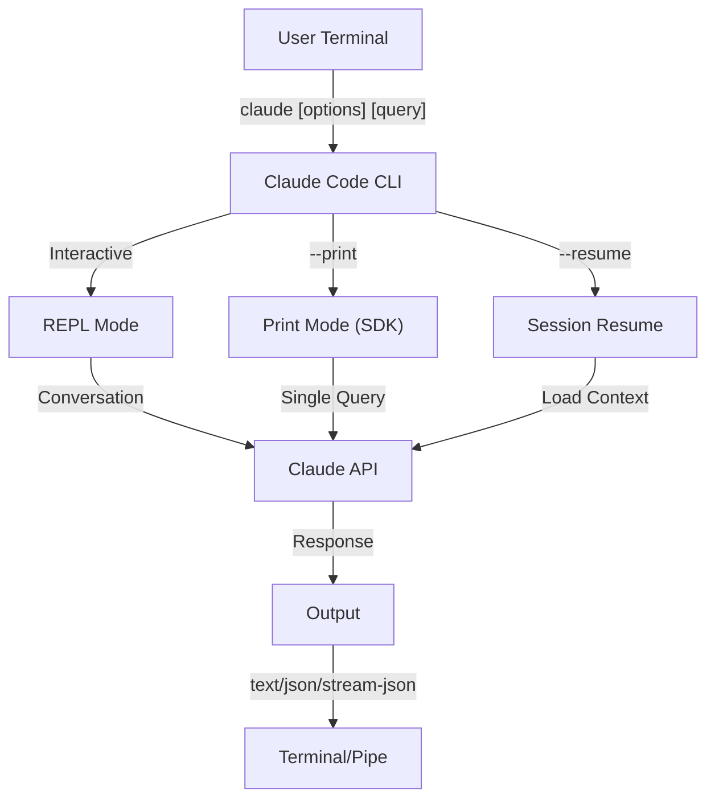
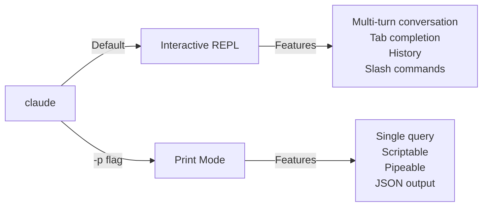

<picture>
  <source media="(prefers-color-scheme: dark)" srcset="../resources/logos/claude-howto-logo-dark.svg">
  
</picture>

# CLI Reference

## Overview

The Claude Code CLI (Command Line Interface) is the primary way to interact with Claude Code. It provides powerful options for running queries, managing sessions, configuring models, and integrating Claude into your development workflows.

## Architecture



## Runtime & Packaging

Since **v2.1.113**, the Claude Code CLI launches a **native per-platform binary** (macOS, Linux, Windows) via optional npm dependencies. The binary is matched to your OS and architecture at install time — the older bundled-JavaScript runtime is no longer the default on macOS or Linux.

The **user-facing install is unchanged**: `npm install -g @anthropic-ai/claude-code` still works and remains the recommended path. Behind the scenes npm fetches the correct native binary for your platform.

**Download host** (v2.1.116+): native-binary artifacts are served from `https://downloads.claude.ai/claude-code-releases`.

> **Corporate / proxy users**: If your network requires an explicit allowlist, add `downloads.claude.ai` (and `https://downloads.claude.ai/claude-code-releases`) to your proxy egress rules. Environments that previously allowlisted only `storage.googleapis.com` or the npm registry will need to be updated or `claude update` and the initial install will fail.

The older JavaScript bundle is still produced for Windows and for environments that pin to it; those installs continue to ship Glob and Grep as first-class tools (see the Glob/Grep footnote under [Tools](#tool--permission-management)).

## CLI Commands

| Command | Description | Example |
|---------|-------------|---------|
| `claude` | Start interactive REPL | `claude` |
| `claude "query"` | Start REPL with initial prompt | `claude "explain this project"` |
| `claude -p "query"` | Print mode - query then exit | `claude -p "explain this function"` |
| `cat file \| claude -p "query"` | Process piped content | `cat logs.txt \| claude -p "explain"` |
| `claude -c` | Continue most recent conversation | `claude -c` |
| `claude -c -p "query"` | Continue in print mode | `claude -c -p "check for type errors"` |
| `claude -r "<session>" "query"` | Resume session by ID or name | `claude -r "auth-refactor" "finish this PR"` |
| `claude update` | Update to latest version | `claude update` |
| `/doctor` (slash command) | Diagnose installation, config, and plugin health. Since v2.1.116 it can be opened **while Claude is responding**, shows status icons inline, and accepts the `f` keypress to auto-fix detected issues. v2.1.178 refreshed the layout to a flat tree with clearer status icons and highlighted commands | run `/doctor` inside the REPL |
| `claude mcp` | Configure MCP servers (incl. `login`/`logout` for auth, v2.1.186+) | See [MCP documentation](../05-mcp/) |
| `claude mcp serve` | Run Claude Code as an MCP server | `claude mcp serve` |
| `claude agents` | Open the **Agent View** (Research Preview, v2.1.139+) — multi-session manager listing every Claude Code session with its status. See [Agent View](#agent-view-claude-agents-v21139) below. | `claude agents` |
| `claude auto-mode defaults` | Print auto mode default rules as JSON | `claude auto-mode defaults` |
| `claude auto-mode reset` | Restore default auto-mode configuration, with a confirmation prompt (`--yes` to skip) (v2.1.212) | `claude auto-mode reset --yes` |
| `claude --remote-control [name]` | Start Remote Control (a flag, not a subcommand; alias `--rc`) | `claude --rc` |
| `claude plugin` | Manage plugins (install, enable, disable) | `claude plugin install my-plugin` |
| `claude plugin init <name>` | Scaffold a new plugin at `~/.claude/skills/<name>/` (user-global) — auto-loads in the next session as `<name>@skills-dir`, no marketplace required (v2.1.157+) | `claude plugin init my-plugin` |
| `claude plugin tag [path]` | Create a `{name}--v{version}` release git tag for the plugin at `[path]`, validating that `plugin.json` and any enclosing marketplace entry agree (v2.1.118+) | `claude plugin tag ./my-plugin` |
| `claude install [version]` | Install a specific native-binary version. Accepts `stable`, `latest`, or an explicit version string | `claude install 2.1.131` |
| `claude project purge [path]` | Delete all local Claude Code state for a project (transcripts, tasks, debug logs, file-edit history, prompt history, and `~/.claude.json` entry). Omit `[path]` for an interactive picker. Flags: `--dry-run` to preview, `-y/--yes` to skip confirmation, `-i/--interactive` to confirm each item, `--all` for every project (v2.1.126+) | `claude project purge ~/work/repo --dry-run` |
| `claude plugin prune` | Remove orphaned auto-installed plugin dependencies (parent plugin gone). `plugin uninstall --prune` does the same cascade after uninstalling a target (v2.1.121+) | `claude plugin prune` |
| `claude ultrareview [target]` | Run `/ultrareview` non-interactively. Prints findings to stdout, exits 0 on success / 1 on failure. Use `--json` for raw payload, `--timeout <minutes>` to override the 30-minute default, and `--post` / `--no-post` to control whether findings are posted back to the PR. **Requires Claude Code v2.1.227 or later** | `claude ultrareview 1234 --json --no-post` |
| `claude self-hosted-runner <setup\|doctor\|orchestrator>` | Turn your own machine or container into a place Claude Code web, mobile, and desktop sessions can run. `setup` provisions the runner, `doctor` diagnoses it, `orchestrator` runs the coordinating process. **Team and Enterprise plans; requires Claude Code v2.1.224 or later.** On Windows, startup requires an explicit `--base-dir` (v2.1.229) | `claude self-hosted-runner setup` |
| `claude auth login` | Log in (supports `--email`, `--sso`). Since v2.1.126, accepts the OAuth code pasted into the terminal as a fallback when the browser callback can't reach localhost (WSL2, SSH, containers) | `claude auth login --email user@example.com` |
| `claude auth logout` | Log out of current account | `claude auth logout` |
| `claude auth status` | Check auth status (exit 0 if logged in, 1 if not) | `claude auth status` |

## Core Flags

| Flag | Description | Example |
|------|-------------|---------|
| `-p, --print` | Print response without interactive mode | `claude -p "query"` |
| `-c, --continue` | Load most recent conversation | `claude --continue` |
| `-r, --resume` | Resume specific session by ID or name | `claude --resume auth-refactor` |
| `-v, --version` | Output version number | `claude -v` |
| `-w, --worktree` | Start in isolated git worktree. Accepts a GitLab merge-request URL as well as a GitHub PR URL since v2.1.233 | `claude -w` |
| `-n, --name` | Session display name | `claude -n "auth-refactor"` |
| `--from-pr <url-or-number>` | Resume sessions linked to a pull/merge request. Accepts GitHub (cloud + Enterprise), GitLab MR, and Bitbucket PR URLs since v2.1.119; previously GitHub.com only | `claude --from-pr 42` or `claude --from-pr https://gitlab.example.com/org/repo/-/merge_requests/17` |
| `--cloud [description\|session_id\|url]` | Create a cloud session on claude.ai with the given description, or attach to an existing one by session ID or claude.ai/code URL | `claude --cloud "implement API"` |
| `--remote "task"` | **Deprecated alias for `--cloud`**, including the existing-session form. Use `--cloud` instead | `claude --remote "implement API"` |
| `--remote-control, --rc` | Interactive session with Remote Control | `claude --rc` |
| `--teleport [session]` | Resume a web session locally. Bare form opens a picker of your web sessions; pass a session ID to resume that session directly. Requires a claude.ai subscription | `claude --teleport` |
| `--teammate-mode` | Agent team display mode | `claude --teammate-mode tmux` |
| `--bare` | Minimal mode (skip hooks, skills, plugins, MCP, auto memory, CLAUDE.md) | `claude --bare` |
| `--safe-mode` | Start with all customizations disabled (CLAUDE.md, plugins, skills, hooks, MCP) to isolate config problems; also `CLAUDE_CODE_SAFE_MODE=1` (v2.1.169) | `claude --safe-mode` |
| `--restricted` | Lock the session down for untrusted or shared use: removes the built-in command- and code-running tools and WebFetch, ignores user/project/local settings, confines file tools to the working directories, and refuses `bypassPermissions` and cloud sessions. Also `CLAUDE_CODE_RESTRICTED=1` (v2.1.248+) | `claude --restricted -p "summarize this repo"` |
| `--permission-mode auto` | Start in auto permission mode (replaces the removed `--enable-auto-mode` flag, gone since v2.1.111) | `claude --permission-mode auto` |
| `--channels` | Subscribe to MCP channel plugins. Entries must be tagged `plugin:<name>@<marketplace>`; bare names are rejected | `claude --channels plugin:discord@my-marketplace` |
| `--chrome` / `--no-chrome` | Enable/disable Chrome browser integration | `claude --chrome` |
| `--effort` | Set thinking effort level | `claude --effort high` |
| `--init` / `--init-only` | Run initialization hooks | `claude --init` |
| `--maintenance` | Run maintenance hooks and exit | `claude --maintenance` |
| `--disable-slash-commands` | Disable all skills and slash commands | `claude --disable-slash-commands` |
| `--no-session-persistence` | Disable session saving (print mode) | `claude -p --no-session-persistence "query"` |
| `--exclude-dynamic-system-prompt-sections` | Exclude dynamic sections from the system prompt for better prompt cache hit rates | `claude -p --exclude-dynamic-system-prompt-sections "query"` |

### Restricted Mode (`--restricted`, v2.1.248+)

`--restricted` (or `CLAUDE_CODE_RESTRICTED=1`) is for running `claude` on behalf of someone whose input you do not control — an evaluation harness on a shared machine, a CI job triggered by an outside contributor, a demo box. It applies all of the following:

- **Removes the tools that run commands or code** — Bash, PowerShell, and the REPL — plus WebFetch, unless `--tools` explicitly names them.
- **Ignores user, project, and local settings files.** Managed settings and an explicit `--settings` file still apply, so an administrator keeps control while a checked-in `.claude/settings.json` cannot widen the sandbox.
- **Confines the file tools to the working directories**, so reads and writes cannot escape the paths you started in.
- **Refuses `bypassPermissions`**, whichever way it is requested.
- **Refuses to create cloud sessions**, so a restricted run cannot push work off the machine.

```bash
# Evaluation harness: no shell, no network fetches, no settings inheritance
claude --restricted -p "summarize the architecture of this repo"

# Same lockdown, but deliberately re-enable one tool
claude --restricted --tools WebFetch -p "check the linked RFC"
```

> **Note**: `--restricted` is a coarser lock than `--permission-mode`. It removes tools outright rather than prompting for them, so a restricted session cannot be widened from inside the session.

### Interactive vs Print Mode



**Interactive Mode** (default):
```bash
# Start interactive session
claude

# Start with initial prompt
claude "explain the authentication flow"
```

**Print Mode** (non-interactive):
```bash
# Single query, then exit
claude -p "what does this function do?"

# Process file content
cat error.log | claude -p "explain this error"

# Chain with other tools
claude -p "list todos" | grep "URGENT"
```

## Model & Configuration

| Flag | Description | Example |
|------|-------------|---------|
| `--model` | Set model (sonnet, opus, haiku, or full name) | `claude --model opus` |
| `--fallback-model` | Automatic model fallback when the primary is overloaded/unavailable; configure up to three via the `fallbackModel` setting. Applies to interactive sessions too since v2.1.166 (previously print mode only) | `claude -p --fallback-model sonnet "query"` |
| `--agent` | Specify agent for session | `claude --agent my-custom-agent` |
| `--agents` | Define custom subagents via JSON | See [Agents Configuration](#agents-configuration) |
| `--effort` | Set effort level (low, medium, high, xhigh, max) | `claude --effort xhigh` |

### Model Selection Examples

```bash
# Use Opus 5 for complex tasks
claude --model opus "design a caching strategy"

# Use Haiku 4.5 for quick tasks
claude --model haiku -p "format this JSON"

# Full model name
claude --model claude-sonnet-4-6-20250929 "review this code"

# With fallback for reliability
claude -p --model opus --fallback-model sonnet "analyze architecture"

# Use opusplan (Opus plans, Sonnet executes)
claude --model opusplan "design and implement the caching layer"
```

> **Gateway model discovery (v2.1.129+, opt-in)**: When `ANTHROPIC_BASE_URL` points at an Anthropic-compatible gateway, set `CLAUDE_CODE_ENABLE_GATEWAY_MODEL_DISCOVERY=1` to populate `/model` from the gateway's `/v1/models` endpoint. Without the env var, `/model` falls back to the built-in static list. The flag is opt-in (changed in v2.1.129) because the discovery call can surface models a user may not be entitled to use; v2.1.126 made it implicit and that behavior was reverted.

> **Org default model (v2.1.196)**: When an org admin sets a default model, `/model` labels it as "Org default" (or "Role default").

## System Prompt Customization

| Flag | Description | Example |
|------|-------------|---------|
| `--system-prompt` | Replace entire default prompt | `claude --system-prompt "You are a Python expert"` |
| `--system-prompt-file` | Load prompt from file (print mode) | `claude -p --system-prompt-file ./prompt.txt "query"` |
| `--append-system-prompt` | Append to default prompt | `claude --append-system-prompt "Always use TypeScript"` |
| `--append-subagent-system-prompt` | Append text to every subagent's system prompt (non-interactive) | `claude -p --append-subagent-system-prompt "Cite sources" "query"` |
| `--append-subagent-system-prompt-file` | (v2.1.261) Load that appended text from a file instead, for prompts too long to pass on the command line. Non-interactive only, and **cannot be combined** with `--append-subagent-system-prompt` | `claude -p --append-subagent-system-prompt-file ./subagent-rules.txt "query"` |

### System Prompt Examples

```bash
# Complete custom persona
claude --system-prompt "You are a senior security engineer. Focus on vulnerabilities."

# Append specific instructions
claude --append-system-prompt "Always include unit tests with code examples"

# Load complex prompt from file
claude -p --system-prompt-file ./prompts/code-reviewer.txt "review main.py"
```

### System Prompt Flags Comparison

| Flag | Behavior | Interactive | Print |
|------|----------|-------------|-------|
| `--system-prompt` | Replaces entire default system prompt | ✅ | ✅ |
| `--system-prompt-file` | Replaces with prompt from file | ❌ | ✅ |
| `--append-system-prompt` | Appends to default system prompt | ✅ | ✅ |

**Use `--system-prompt-file` only in print mode. For interactive mode, use `--system-prompt` or `--append-system-prompt`.**

## Tool & Permission Management

| Flag | Description | Example |
|------|-------------|---------|
| `--tools` | Restrict available built-in tools | `claude -p --tools "Bash,Edit,Read" "query"` |
| `--allowedTools` | Tools that execute without prompting | `"Bash(git log:*)" "Read"` |
| `--disallowedTools` | Tools removed from context | `"Bash(rm:*)" "Edit"` |
| `--dangerously-skip-permissions` | Skip all permission prompts | `claude --dangerously-skip-permissions` |
| `--permission-mode` | Begin in specified permission mode | `claude --permission-mode auto` |
| `--permission-prompt-tool` | MCP tool for permission handling | `claude -p --permission-prompt-tool mcp_auth "query"` |
| `--permission-prompts` | (v2.1.259) Who answers permission prompts in print mode. Default `host` sends them to the Agent SDK host or the `--permission-prompt-tool` tool; pass `none` when nobody can answer and Claude Code denies them instead | `claude -p --permission-prompts none "query"` |

> **v2.1.111 update**: `--enable-auto-mode` was removed; auto mode is now in the `Shift+Tab` cycle by default — use `--permission-mode auto` to start in it directly.

> **Glob / Grep footnote (v2.1.113+)**: On native macOS/Linux builds, `Glob` and `Grep` are provided as the embedded `bfs` and `ugrep` binaries invoked through the Bash tool rather than as separate first-class tools. Windows and npm-bundled (JS) installs still expose them as standalone tools. For subagent `allowedTools` / `disallowedTools` lists the backend substitution is transparent — you can keep referring to `Glob` / `Grep` in your configuration on every platform.

> **PowerShell auto-approve (v2.1.119)**: PowerShell tool commands can be auto-approved in permission mode exactly the same way Bash commands are. Use the same matcher syntax you already use for `Bash(...)` rules to scope PowerShell permissions — for example, `PowerShell(Get-ChildItem:*)`.

> **`--permission-mode` honored on resume (v2.1.132+)**: `claude -p --continue --permission-mode plan` (and `--resume`) now respects the flag. Earlier versions silently dropped `--permission-mode` when resuming a session, so a plan-mode session resumed without re-passing the flag would silently downgrade — that's fixed.

> **Permission hardening (v2.1.214)**: Docker/Podman commands using daemon-redirect flags (e.g. `--url`, `--connection`, `--identity`) now require a permission prompt instead of running automatically. `file` commands using `-m`/`--magic-file` or `-f`/`--files-from` also now require permission. Bash commands over 10,000 characters always prompt for permission, regardless of allow rules.

### Permission Examples

```bash
# Read-only mode for code review
claude --permission-mode plan "review this codebase"

# Restrict to safe tools only
claude --tools "Read,Grep,Glob" -p "find all TODO comments"

# Allow specific git commands without prompts
claude --allowedTools "Bash(git status:*)" "Bash(git log:*)"

# Block dangerous operations
claude --disallowedTools "Bash(rm -rf:*)" "Bash(git push --force:*)"
```

> **Parameter matching `Tool(param:value)` (v2.1.178)**: Permission rules follow the format `Tool` (every use) or `Tool(specifier)`. As of v2.1.178, a specifier can match a tool's input **parameters**, not just command or path patterns — using the `Tool(param:value)` form with wildcard support. This generalizes the matching you already use for `Bash(...)` command prefixes (e.g. `Bash(npm run test *)`) and `Read(...)` path globs (e.g. `Read(./.env.*)`) so other tools can be scoped by their arguments. Check the [permissions reference](https://code.claude.com/docs/en/settings) for the current per-tool example strings before writing a rule, since the exact parameter names differ by tool.

## Output & Format

| Flag | Description | Options | Example |
|------|-------------|---------|---------|
| `--output-format` | Specify output format (print mode) | `text`, `json`, `stream-json` | `claude -p --output-format json "query"` |
| `--input-format` | Specify input format (print mode) | `text`, `stream-json` | `claude -p --input-format stream-json` |
| `--verbose` | Enable verbose logging | | `claude --verbose` |
| `--include-partial-messages` | Include streaming events | Requires `stream-json` | `claude -p --output-format stream-json --include-partial-messages "query"` |
| `--forward-subagent-text` | Forward subagent text output into the stream. As of v2.1.219, subagents spawned at depth 2 or deeper are forwarded too, keyed by their spawning `Agent` `tool_use` id (this is how you observe the nesting enabled by default via `CLAUDE_CODE_MAX_SUBAGENT_SPAWN_DEPTH`) | Requires `stream-json` | `claude -p --output-format stream-json --forward-subagent-text "query"` |
| `--json-schema` | Get validated JSON matching schema | | `claude -p --json-schema '{"type":"object"}' "query"` |
| `--max-budget-usd` | Maximum spend for print mode. Since v2.1.217, hitting the cap also halts running background subagents and denies new spawns (previously background agents kept running past the cap) | | `claude -p --max-budget-usd 5.00 "query"` |

### Output Format Examples

```bash
# Plain text (default)
claude -p "explain this code"

# JSON for programmatic use
claude -p --output-format json "list all functions in main.py"

# Streaming JSON for real-time processing
claude -p --output-format stream-json "generate a long report"

# Structured output with schema validation
claude -p --json-schema '{"type":"object","properties":{"bugs":{"type":"array"}}}' \
  "find bugs in this code and return as JSON"
```

## Workspace & Directory

| Flag | Description | Example |
|------|-------------|---------|
| `--add-dir` | Add additional working directories | `claude --add-dir ../apps ../lib` |
| `--setting-sources` | Comma-separated setting sources | `claude --setting-sources user,project` |

> **`/config` persistence (v2.1.119)**: Changes made interactively via the `/config` command are now written to `~/.claude/settings.json` and participate in the normal precedence chain (policy → local → project → user). Before v2.1.119, some `/config` changes were session-only. See [Memory & Settings](../02-memory/README.md) for the full precedence order.
| `--settings` | Load settings from file or JSON. File must be no larger than 2 MiB (v2.1.214) | `claude --settings ./settings.json` |
| `--plugin-dir` | Load plugins from directory (repeatable) | `claude --plugin-dir ./my-plugin` |

### Multi-Directory Example

```bash
# Work across multiple project directories
claude --add-dir ../frontend ../backend ../shared "find all API endpoints"

# Load custom settings
claude --settings '{"model":"opus","verbose":true}' "complex task"
```

## MCP Configuration

| Flag | Description | Example |
|------|-------------|---------|
| `--mcp-config` | Load MCP servers from JSON | `claude --mcp-config ./mcp.json` |
| `--strict-mcp-config` | Only use specified MCP config | `claude --strict-mcp-config --mcp-config ./mcp.json` |
| `--channels` | Subscribe to MCP channel plugins. Entries must be tagged `plugin:<name>@<marketplace>`; bare names are rejected | `claude --channels plugin:discord@my-marketplace` |

### MCP Examples

```bash
# Load GitHub MCP server
claude --mcp-config ./github-mcp.json "list open PRs"

# Strict mode - only specified servers
claude --strict-mcp-config --mcp-config ./production-mcp.json "deploy to staging"
```

## Session Management

| Flag | Description | Example |
|------|-------------|---------|
| `--session-id` | Use specific session ID (UUID) | `claude --session-id "550e8400-..."` |
| `--fork-session` | Create new session when resuming | `claude --resume abc123 --fork-session` |

### Session Examples

```bash
# Continue last conversation
claude -c

# Resume named session
claude -r "feature-auth" "continue implementing login"

# Fork session for experimentation
claude --resume feature-auth --fork-session "try alternative approach"

# Use specific session ID
claude --session-id "550e8400-e29b-41d4-a716-446655440000" "continue"
```

### Session Fork

Create a branch from an existing session for experimentation:

```bash
# Fork a session to try a different approach
claude --resume abc123 --fork-session "try alternative implementation"

# Fork with a custom message
claude -r "feature-auth" --fork-session "test with different architecture"
```

**Use Cases:**
- Try alternative implementations without losing the original session
- Experiment with different approaches in parallel
- Create branches from successful work for variations
- Test breaking changes without affecting the main session

The original session remains unchanged, and the fork becomes a new independent session.

### Project State Cleanup (v2.1.126+)

`claude project purge` deletes all local Claude Code state for a project — transcripts, task lists, debug logs, file-edit history, prompt history lines, and the project's `~/.claude.json` entry. Use `--dry-run` first to preview the deletion; `--all` walks every project on the machine.

```bash
# Preview what would be deleted (safe)
claude project purge ~/work/repo --dry-run

# Delete state for a specific project, no prompts
claude project purge ~/work/repo --yes

# Walk every project interactively
claude project purge --all --interactive
```

## Advanced Features

| Flag | Description | Example |
|------|-------------|---------|
| `--chrome` | Enable Chrome browser integration | `claude --chrome` |
| `--no-chrome` | Disable Chrome browser integration | `claude --no-chrome` |
| `--ide` | Auto-connect to IDE if available | `claude --ide` |
| `--max-turns` | Limit agentic turns (non-interactive) | `claude -p --max-turns 3 "query"` |
| `--debug` | Enable debug mode with filtering | `claude --debug "api,mcp"` |
| `--enable-lsp-logging` | Enable verbose LSP logging | `claude --enable-lsp-logging` |
| `--betas` | Beta headers for API requests | `claude --betas interleaved-thinking` |
| `--plugin-dir` | Load plugins from directory (repeatable) | `claude --plugin-dir ./my-plugin` |
| `--effort` | Set thinking effort level | `claude --effort high` |
| `--bare` | Minimal mode (skip hooks, skills, plugins, MCP, auto memory, CLAUDE.md) | `claude --bare` |
| `--channels` | Subscribe to MCP channel plugins (tagged `plugin:<name>@<marketplace>`) | `claude --channels plugin:discord@my-marketplace` |
| `--tmux` | Create tmux session for worktree | `claude --tmux` |
| `--fork-session` | Create new session ID when resuming | `claude --resume abc --fork-session` |
| `--max-budget-usd` | Maximum spend (print mode); also halts background subagents when hit (v2.1.217) | `claude -p --max-budget-usd 5.00 "query"` |
| `--json-schema` | Validated JSON output | `claude -p --json-schema '{"type":"object"}' "q"` |
| `--ax-screen-reader` | Plain-text rendering mode for screen readers (v2.1.208) | `claude --ax-screen-reader` |

### Platform & Theme Notes (v2.1.112)

- **PowerShell tool on Windows**: A dedicated PowerShell tool is rolling out on Windows and is controllable via environment variable.
- **Auto (match terminal) theme**: The new "Auto (match terminal)" theme syncs Claude Code's light/dark appearance with your terminal.
- **Quieter permission prompts**: Read-only `Bash` invocations and `Glob` patterns no longer trigger permission prompts.

### Advanced Examples

```bash
# Limit autonomous actions
claude -p --max-turns 5 "refactor this module"

# Debug API calls
claude --debug "api" "test query"

# Enable IDE integration
claude --ide "help me with this file"
```

## Agents Configuration

The `--agents` flag accepts a JSON object defining custom subagents for a session.

As of **v2.1.243**, `--agents` no longer silently ignores invalid JSON or an invalid agent definition — it exits with a clear error, matching how `--mcp-config` already behaved.

### Agents JSON Format

```json
{
  "agent-name": {
    "description": "Required: when to invoke this agent",
    "prompt": "Required: system prompt for the agent",
    "tools": ["Optional", "array", "of", "tools"],
    "model": "optional: sonnet|opus|haiku"
  }
}
```

**Required Fields:**
- `description` - Natural language description of when to use this agent
- `prompt` - System prompt that defines the agent's role and behavior

**Optional Fields:**
- `tools` - Array of available tools (inherits all if omitted)
  - Format: `["Read", "Grep", "Glob", "Bash"]`
- `model` - Model to use: `sonnet`, `opus`, or `haiku`

### Complete Agents Example

```json
{
  "code-reviewer": {
    "description": "Expert code reviewer. Use proactively after code changes.",
    "prompt": "You are a senior code reviewer. Focus on code quality, security, and best practices.",
    "tools": ["Read", "Grep", "Glob", "Bash"],
    "model": "sonnet"
  },
  "debugger": {
    "description": "Debugging specialist for errors and test failures.",
    "prompt": "You are an expert debugger. Analyze errors, identify root causes, and provide fixes.",
    "tools": ["Read", "Edit", "Bash", "Grep"],
    "model": "opus"
  },
  "documenter": {
    "description": "Documentation specialist for generating guides.",
    "prompt": "You are a technical writer. Create clear, comprehensive documentation.",
    "tools": ["Read", "Write"],
    "model": "haiku"
  }
}
```

### Agents Command Examples

```bash
# Define custom agents inline
claude --agents '{
  "security-auditor": {
    "description": "Security specialist for vulnerability analysis",
    "prompt": "You are a security expert. Find vulnerabilities and suggest fixes.",
    "tools": ["Read", "Grep", "Glob"],
    "model": "opus"
  }
}' "audit this codebase for security issues"

# Load agents from file
claude --agents "$(cat ~/.claude/agents.json)" "review the auth module"

# Combine with other flags
claude -p --agents "$(cat agents.json)" --model sonnet "analyze performance"
```

### Agent Priority

When multiple agent definitions exist, they are loaded in this priority order:
1. **CLI-defined** (`--agents` flag) - Session-specific
2. **Project-level** (`.claude/agents/`) - Current project
3. **User-level** (`~/.claude/agents/`) - All projects

CLI-defined agents override both project and user agents for the session. Project-level agents override user-level agents when their names collide. See [Lesson 04 — Subagents](../04-subagents/README.md#file-locations) for the full priority table including plugin-level agents.

### Agent View (`claude agents`, v2.1.139+)

> **Research Preview** — feature is stable enough for daily use but may change.

`claude agents` opens the **Agent View** — a single list of every Claude Code session on the machine with its current status (`running`, `blocked on you`, `done`). It is the replacement for juggling multiple terminal tabs when you run background agents, scheduled tasks, or `--bg`-launched sessions.

```bash
# Open the Agent View
claude agents
```

When you dispatch a session from the view (or via `claude --bg <prompt>`), you can pass the same configuration flags you would pass to `claude` itself. Flags introduced for the Agent View dispatch path:

| Flag | Since | Description |
|------|-------|-------------|
| `--cwd <path>` | v2.1.141 | Scope the session list (or new session) to a specific working directory |
| `--add-dir <path>` | v2.1.142 | Add directories to the dispatched session's workspace |
| `--settings <path>` | v2.1.142 | Use a specific `settings.json` for the dispatched session |
| `--mcp-config <path>` | v2.1.142 | Use a specific MCP config for the dispatched session |
| `--plugin-dir <path>` | v2.1.142 | Use a specific plugin directory for the dispatched session |
| `--permission-mode <mode>` | v2.1.142 | Set permission mode (`plan`, `acceptEdits`, `auto`, etc.) for the dispatched session |
| `--model <model>` | v2.1.142 | Pin a model for the dispatched session |
| `--effort <level>` | v2.1.142 | Pin an effort level (`low`/`medium`/`high`/`xhigh`/`max`) |
| `--dangerously-skip-permissions` | v2.1.142 | Run the dispatched session without permission prompts (use only in sandboxes) |
| `--json` | v2.1.145 | Print the agent list as machine-readable JSON for scripting (status bars, session pickers, tmux-resurrect integrations) |

Sessions that finish their work but leave a background shell open move from "Working" to "Completed" (v2.1.141 fix). Within an attached agent session, `Shift+Tab` cycles through permission modes including auto mode (v2.1.143).

**GitLab merge requests (v2.1.233)** — the Agent View recognizes GitLab MR URLs alongside GitHub PR URLs, and displays merge requests as `!N` (GitHub pull requests stay `#N`). The same release taught `--worktree` to accept a GitLab MR URL.

**Pin a session** — press `Ctrl+T` on a session in `claude agents` to pin it (v2.1.147). Pinned background sessions stay alive when idle, are restarted in place to apply Claude Code updates, and are shed under memory pressure only after non-pinned sessions. (This `Ctrl+T` is scoped to the Agent View; in the main session it toggles the task list view.)

---

## High-Value Use Cases

### 1. CI/CD Integration

Use Claude Code in your CI/CD pipelines for automated code review, testing, and documentation.

**GitHub Actions Example:**

```yaml
name: AI Code Review

on: [pull_request]

jobs:
  review:
    runs-on: ubuntu-latest
    steps:
      - uses: actions/checkout@v4

      - name: Install Claude Code
        run: npm install -g @anthropic-ai/claude-code

      - name: Run Code Review
        env:
          ANTHROPIC_API_KEY: ${{ secrets.ANTHROPIC_API_KEY }}
        run: |
          claude -p --output-format json \
            --max-turns 1 \
            "Review the changes in this PR for:
            - Security vulnerabilities
            - Performance issues
            - Code quality
            Output as JSON with 'issues' array" > review.json

      - name: Post Review Comment
        uses: actions/github-script@v7
        with:
          script: |
            const fs = require('fs');
            const review = JSON.parse(fs.readFileSync('review.json', 'utf8'));
            // Process and post review comments
```

**Jenkins Pipeline:**

```groovy
pipeline {
    agent any
    stages {
        stage('AI Review') {
            steps {
                sh '''
                    claude -p --output-format json \
                      --max-turns 3 \
                      "Analyze test coverage and suggest missing tests" \
                      > coverage-analysis.json
                '''
            }
        }
    }
}
```

**Headless `ultrareview` (requires v2.1.227+):**

```yaml
# .github/workflows/ultrareview.yml
- name: Claude ultrareview
  run: claude ultrareview ${{ github.event.pull_request.number }} --json --no-post > review.json
```

`claude ultrareview` exits 0 on a clean review and 1 when findings are reported, so it's a drop-in PR gate. Use `--timeout <minutes>` to override the 30-minute default. `--post` posts the finished findings to the pull request; `--no-post` keeps them in stdout only, which is what you want when a later CI step formats the report itself.

### 2. Script Piping

Process files, logs, and data through Claude for analysis.

**Log Analysis:**

```bash
# Analyze error logs
tail -1000 /var/log/app/error.log | claude -p "summarize these errors and suggest fixes"

# Find patterns in access logs
cat access.log | claude -p "identify suspicious access patterns"

# Analyze git history
git log --oneline -50 | claude -p "summarize recent development activity"
```

**Code Processing:**

```bash
# Review a specific file
cat src/auth.ts | claude -p "review this authentication code for security issues"

# Generate documentation
cat src/api/*.ts | claude -p "generate API documentation in markdown"

# Find TODOs and prioritize
grep -r "TODO" src/ | claude -p "prioritize these TODOs by importance"
```

### 3. Multi-Session Workflows

Manage complex projects with multiple conversation threads.

```bash
# Start a feature branch session
claude -r "feature-auth" "let's implement user authentication"

# Later, continue the session
claude -r "feature-auth" "add password reset functionality"

# Fork to try an alternative approach
claude --resume feature-auth --fork-session "try OAuth instead"

# Switch between different feature sessions
claude -r "feature-payments" "continue with Stripe integration"
```

### 4. Custom Agent Configuration

Define specialized agents for your team's workflows.

```bash
# Save agents config to file
cat > ~/.claude/agents.json << 'EOF'
{
  "reviewer": {
    "description": "Code reviewer for PR reviews",
    "prompt": "Review code for quality, security, and maintainability.",
    "model": "opus"
  },
  "documenter": {
    "description": "Documentation specialist",
    "prompt": "Generate clear, comprehensive documentation.",
    "model": "sonnet"
  },
  "refactorer": {
    "description": "Code refactoring expert",
    "prompt": "Suggest and implement clean code refactoring.",
    "tools": ["Read", "Edit", "Glob"]
  }
}
EOF

# Use agents in session
claude --agents "$(cat ~/.claude/agents.json)" "review the auth module"
```

### 5. Batch Processing

Process multiple queries with consistent settings.

```bash
# Process multiple files
for file in src/*.ts; do
  echo "Processing $file..."
  claude -p --model haiku "summarize this file: $(cat $file)" >> summaries.md
done

# Batch code review
find src -name "*.py" -exec sh -c '
  echo "## $1" >> review.md
  cat "$1" | claude -p "brief code review" >> review.md
' _ {} \;

# Generate tests for all modules
for module in $(ls src/modules/); do
  claude -p "generate unit tests for src/modules/$module" > "tests/$module.test.ts"
done
```

### 6. Security-Conscious Development

Use permission controls for safe operation.

```bash
# Read-only security audit
claude --permission-mode plan \
  --tools "Read,Grep,Glob" \
  "audit this codebase for security vulnerabilities"

# Block dangerous commands
claude --disallowedTools "Bash(rm:*)" "Bash(curl:*)" "Bash(wget:*)" \
  "help me clean up this project"

# Restricted automation
claude -p --max-turns 2 \
  --allowedTools "Read" "Glob" \
  "find all hardcoded credentials"
```

### 7. JSON API Integration

Use Claude as a programmable API for your tools with `jq` parsing.

```bash
# Get structured analysis
claude -p --output-format json \
  --json-schema '{"type":"object","properties":{"functions":{"type":"array"},"complexity":{"type":"string"}}}' \
  "analyze main.py and return function list with complexity rating"

# Integrate with jq for processing
claude -p --output-format json "list all API endpoints" | jq '.endpoints[]'

# Use in scripts
RESULT=$(claude -p --output-format json "is this code secure? answer with {secure: boolean, issues: []}" < code.py)
if echo "$RESULT" | jq -e '.secure == false' > /dev/null; then
  echo "Security issues found!"
  echo "$RESULT" | jq '.issues[]'
fi
```

### jq Parsing Examples

Parse and process Claude's JSON output using `jq`:

```bash
# Extract specific fields
claude -p --output-format json "analyze this code" | jq '.result'

# Filter array elements
claude -p --output-format json "list issues" | jq -r '.issues[] | select(.severity=="high")'

# Extract multiple fields
claude -p --output-format json "describe the project" | jq -r '.{name, version, description}'

# Convert to CSV
claude -p --output-format json "list functions" | jq -r '.functions[] | [.name, .lineCount] | @csv'

# Conditional processing
claude -p --output-format json "check security" | jq 'if .vulnerabilities | length > 0 then "UNSAFE" else "SAFE" end'

# Extract nested values
claude -p --output-format json "analyze performance" | jq '.metrics.cpu.usage'

# Process entire array
claude -p --output-format json "find todos" | jq '.todos | length'

# Transform output
claude -p --output-format json "list improvements" | jq 'map({title: .title, priority: .priority})'
```

---

## Models

Claude Code supports multiple models with different capabilities:

| Model | ID | Context Window | Notes |
|-------|-----|----------------|-------|
| Sonnet 5 | `claude-sonnet-5` | 1M tokens | Default on Pro / Team Standard / Enterprise seats (v2.1.197); native 1M-token context window. As of v2.1.219, **Opus 5** is the default Opus model on Max, Team Premium, Enterprise pay-as-you-go, and the Anthropic API; Microsoft Foundry still resolves the `opus` alias to Opus 4.6 |
| Opus 5 | `claude-opus-5` | 1M tokens | Default Opus model on Max, Team Premium, Enterprise pay-as-you-go, Anthropic API, Claude Platform on AWS, Amazon Bedrock, and Google Cloud's Agent Platform (v2.1.219); adaptive effort levels `low → max`, default effort `high` |
| Opus 4.8 | `claude-opus-4-8` | 1M tokens | Previous flagship Opus, still selectable; adaptive effort levels `low → max`; default effort `high` (v2.1.154) |
| Sonnet 4.6 | `claude-sonnet-4-6` | 1M tokens | Balanced speed and capability; default effort for Pro/Max subscribers raised from `medium` to `high` in v2.1.117 |
| Haiku 4.5 | `claude-haiku-4-5` | 200K tokens | Fastest, best for quick tasks; no effort levels |
| Fable 5.1 | `claude-fable-5-1` | — | Current Fable model; the `fable` alias resolves to it (v2.1.257) |
| Fable 5 | `claude-fable-5` | — | Mythos-class model, made safe for general use (v2.1.170) |

### Model Selection

```bash
# Use short names
claude --model opus "complex architectural review"
claude --model sonnet "implement this feature"
claude --model haiku -p "format this JSON"

# Use opusplan alias (Opus plans, Sonnet executes)
claude --model opusplan "design and implement the API"

# Toggle fast mode during session
/fast
```

> **Fable 5.1 and the `fable` alias (v2.1.257)**: Fable 5.1 (`claude-fable-5-1`) ships in **v2.1.257**, and the `fable` alias now resolves to it rather than to Fable 5. The official model-config page says Fable 5.1 "requires Claude Code v2.1.255 or later", but 2.1.255 was never published — v2.1.257 is the first release users can actually install it with. On a Claude apps gateway, `fable` and `best` still resolve to **Fable 5**; pick 5.1 explicitly in `/model` there.

> **Fast Mode runs on Opus 5 and Opus 4.8 (v2.1.219)**: As of v2.1.219, `/fast` applies to **Opus 5 and Opus 4.8** — Opus 4.7 was removed from fast mode. Opus 5's fast mode is billed at $10/$50 per Mtok. Fast mode first moved to Opus 4.8 in v2.1.154 (about 2× the standard rate for ~2.5× the output speed), having flipped from Opus 4.6 to Opus 4.7 in v2.1.142. The `CLAUDE_CODE_OPUS_4_6_FAST_MODE_OVERRIDE` env var was **deprecated in v2.1.154 and removed on 2026-06-01**; fast mode is no longer available on Opus 4.6 — select Opus 5 or Opus 4.8 instead.

### Effort Levels (Opus 5 / Sonnet 5 / Opus 4.8 / Opus 4.7)

Opus 5, Sonnet 5, Opus 4.8, and Opus 4.7 support adaptive reasoning with effort levels, ordered from lightest to heaviest: `low` (○), `medium` (◐), `high` (●), `xhigh`, and `max`. The **default** is `high` on Opus 5, Sonnet 5, Opus 4.8 (since v2.1.154), Opus 4.6, and Sonnet 4.6, and `xhigh` on Opus 4.7. `xhigh` is available on Opus 5, Sonnet 5, Opus 4.8, and Opus 4.7; `max` works on Opus 5, Sonnet 5, Opus 4.8/4.7/4.6 and Sonnet 4.6 (session-only). Haiku 4.5 has no effort levels. On Opus 4.6 / Sonnet 4.6, the default effort for Pro/Max subscribers was raised from `medium` to `high` in v2.1.117.

```bash
# Set effort level via CLI flag
claude --effort high "complex review"

# Set effort level via slash command
/effort high

# Set effort level via environment variable
export CLAUDE_CODE_EFFORT_LEVEL=high   # low, medium, high, xhigh (Opus 5, Sonnet 5, Opus 4.8/4.7), or max — default is high on Opus 5
```

The "ultrathink" keyword in prompts activates deep reasoning. The `/effort` menu also offers `ultracode`, which is **not** a model effort level — it sends `xhigh` and has Claude orchestrate dynamic workflows (session-only).

---

## Key Environment Variables

| Variable | Description |
|----------|-------------|
| `ANTHROPIC_API_KEY` | API key for authentication |
| `ANTHROPIC_MODEL` | Override default model |
| `ANTHROPIC_DEFAULT_MODEL` | (v2.1.236) Sets the model new sessions start on. Unlike `ANTHROPIC_MODEL`, which pins the model, a `/model` pick still overrides this value **and persists across restarts** — that contrast is the point of the variable. |
| `ANTHROPIC_CUSTOM_MODEL_OPTION` | Custom model option for API |
| `ANTHROPIC_DEFAULT_OPUS_MODEL` | Override default Opus model ID |
| `ANTHROPIC_DEFAULT_SONNET_MODEL` | Override default Sonnet model ID |
| `ANTHROPIC_DEFAULT_HAIKU_MODEL` | Override default Haiku model ID |
| `MAX_THINKING_TOKENS` | Set extended thinking token budget |
| `CLAUDE_CODE_EFFORT_LEVEL` | Set effort level (`low`/`medium`/`high`/`xhigh`/`max`) — default is `high` on Opus 5, Sonnet 5, and Opus 4.8 (`xhigh` on Opus 4.7); `xhigh` needs Opus 5, Sonnet 5, or Opus 4.8/4.7; `max` works on Opus 5, Sonnet 5, Opus 4.8/4.7/4.6 and Sonnet 4.6 |
| `CLAUDE_CODE_SIMPLE` | Minimal mode, set by `--bare` flag |
| `CLAUDE_CODE_SAFE_MODE` | Set to `1` to start with all customizations disabled (CLAUDE.md, plugins, skills, hooks, MCP) — env-var form of `--safe-mode`, for isolating config problems (v2.1.169) |
| `CLAUDE_CODE_DISABLE_BUNDLED_SKILLS` | Set to `1` to hide the bundled skills, workflows, and commands from the model (v2.1.169) |
| `CLAUDE_CODE_DISABLE_AUTO_MEMORY` | Disable automatic CLAUDE.md updates |
| `CLAUDE_CODE_DISABLE_BACKGROUND_TASKS` | Disable background task execution |
| `CLAUDE_CODE_DISABLE_CRON` | Disable scheduled/cron tasks |
| `CLAUDE_CODE_DISABLE_GIT_INSTRUCTIONS` | Disable git-related instructions |
| `CLAUDE_CODE_DISABLE_TERMINAL_TITLE` | Disable terminal title updates |
| `CLAUDE_CODE_DISABLE_1M_CONTEXT` | Disable 1M token context window |
| `CLAUDE_CODE_DISABLE_MOUSE_CLICKS` | Disable mouse click/drag/hover in fullscreen mode; wheel scroll still works (v2.1.195+) |
| `CLAUDE_CODE_DISABLE_NONSTREAMING_FALLBACK` | Disable non-streaming fallback |
| `CLAUDE_CODE_ENABLE_TASKS` | Enable task list feature |
| `CLAUDE_CODE_TASK_LIST_ID` | Named task directory shared across sessions |
| `CLAUDE_CODE_ENABLE_PROMPT_SUGGESTION` | Toggle prompt suggestions (`true`/`false`) |
| `CLAUDE_CODE_EXPERIMENTAL_AGENT_TEAMS` | Enable experimental agent teams |
| `CLAUDE_CODE_NEW_INIT` | Use new initialization flow |
| `CLAUDE_CODE_SUBAGENT_MODEL` | Model for subagent execution |
| `CLAUDE_CODE_PLUGIN_SEED_DIR` | Directory for plugin seed files |
| `CLAUDE_CODE_SUBPROCESS_ENV_SCRUB` | Env vars to scrub from subprocesses |
| `CLAUDE_AUTOCOMPACT_PCT_OVERRIDE` | Override auto-compaction percentage |
| `CLAUDE_STREAM_IDLE_TIMEOUT_MS` | Stream idle timeout in milliseconds |
| `SLASH_COMMAND_TOOL_CHAR_BUDGET` | Character budget for slash command tools |
| `ENABLE_TOOL_SEARCH` | Enable tool search capability |
| `MAX_MCP_OUTPUT_TOKENS` | Maximum tokens for MCP tool output |
| `CLAUDE_CODE_PERFORCE_MODE` | Set to `1` to enable Perforce mode — treats files as read-only by default (for Perforce/P4 version control workflows) (added v2.1.98) |
| `DISABLE_UPDATES` | Blocks all update paths including manual `claude update`. Stricter than `DISABLE_AUTOUPDATER`, which only blocks the background autoupdater (v2.1.118+) |
| `CLAUDE_CODE_HIDE_CWD` | When set to `1`, hides the current working directory in the startup logo (privacy / screen-share use) (v2.1.119+) |
| `CLAUDE_CODE_FORK_SUBAGENT` | Set to `1` to turn fork mode on where it is off by default: non-interactive mode (`claude -p`), the Agent SDK, or Claude Code older than v2.1.232. Since v2.1.232 fork mode is on by default in interactive sessions on every build, first-party or not (GA v2.1.117) |
| `CLAUDE_CODE_DISABLE_ALTERNATE_SCREEN` | Set to `1` to opt out of the fullscreen alternate-screen renderer; the session stays in normal terminal scrollback. Useful when piping transcripts to logs or pairing with `script(1)` (v2.1.132+). |
| `CLAUDE_CODE_SESSION_ID` | Set in every Bash tool subprocess launched by Claude Code; equals the `session_id` in hook input JSON. Use to correlate bash logs with hook telemetry (v2.1.132+). |
| `CLAUDE_CODE_ENABLE_FEEDBACK_SURVEY_FOR_OTEL` | Set to `1` to re-enable Anthropic's session-quality survey for organizations capturing OpenTelemetry data. Off by default in OTEL deployments (v2.1.136+). |
| `OTEL_LOG_TOOL_DETAILS` | Set to `1` to unredact custom and MCP command names in OpenTelemetry events (v2.1.117+). Redaction remains the default. |
| `CLAUDE_CODE_OTEL_CONTENT_MAX_LENGTH` | Configures the truncation limit (default 60 KB) applied to OpenTelemetry content attributes (v2.1.214) |
| `FORCE_HYPERLINK` | Set to `0` to opt out of clickable PR-badge hyperlinks in the footer, which now render even when terminal support can't be auto-detected (v2.1.217) |
| `ANTHROPIC_BEDROCK_SERVICE_TIER` | Selects the Bedrock service tier: `default`, `flex`, or `priority` (v2.1.122+) |
| `AI_AGENT` | Set automatically on subprocesses so external CLIs (e.g., `gh`) can attribute traffic to Claude Code (v2.1.120+) |
| `CLAUDE_CODE_FORCE_SYNC_OUTPUT` | Set to `1` to force synchronous output for terminals where auto-detection misses (e.g., Emacs `eat`) (v2.1.129+) |
| `CLAUDE_CODE_PACKAGE_MANAGER_AUTO_UPDATE` | Set to `1` to enable background upgrades for Homebrew/WinGet installs (which normally do not auto-update) (v2.1.129+) |
| `CLAUDE_CODE_ENABLE_GATEWAY_MODEL_DISCOVERY` | Set to `1` to opt in to gateway `/v1/models` discovery when `ANTHROPIC_BASE_URL` is set. Without it, `/model` shows the built-in static list (v2.1.129+) |
| `CLAUDE_CODE_ENABLE_AUTO_MODE` | Legacy opt-in for auto mode on Bedrock, Vertex, and Foundry (v2.1.158–v2.1.206). As of v2.1.207, auto mode is available by default on those providers for Sonnet 5, Opus 4.7/4.8, and Fable 5 (Opus 5 added in v2.1.219) — this variable is accepted for compatibility but has no effect |
| `CLAUDE_CODE_MAX_WEB_SEARCHES_PER_SESSION` | Cap on WebSearch tool calls per session, to stop runaway search loops. Default 200 (v2.1.212) |
| `CLAUDE_CODE_MAX_CONCURRENT_SUBAGENTS` | Cap on subagents running concurrently. Default 20 (v2.1.217) |
| `CLAUDE_CODE_MAX_SUBAGENT_SPAWN_DEPTH` | Controls how deep nested subagent spawns can go. Since v2.1.219 the default is **3 layers** (was 1); set to `1` to disable nesting entirely |
| `CLAUDE_CODE_MCP_AUTO_BACKGROUND_MS` | Threshold, in milliseconds, before a long-running MCP tool call auto-backgrounds. Default 120000 (2 minutes) (v2.1.212) |
| `CLAUDE_AX_SCREEN_READER` | Set to `1` to enable plain-text screen reader rendering mode. Same effect as `--ax-screen-reader` or `"axScreenReader": true` in settings (v2.1.208) |
| `CLAUDE_CLIENT_PRESENCE_FILE` | Point at a marker file to suppress mobile push notifications while you're at the machine (v2.1.181+). Note: the name is `CLAUDE_CLIENT_PRESENCE_FILE`, not `CLAUDE_CODE_CLIENT_PRESENCE_FILE`. |
| `CLAUDE_CODE_MAX_RETRIES` | Maximum number of API retry attempts. Capped at 15 as of v2.1.186. |
| `CLAUDE_CODE_RETRY_WATCHDOG` | Retry control recommended for unattended sessions, as an alternative to raising `CLAUDE_CODE_MAX_RETRIES` (v2.1.186+). |
| `CLAUDE_ENABLE_STREAM_WATCHDOG` | Streaming idle watchdog (aborts/retries after 5 min with no stream events) is on by default for all providers; set to `0` to disable (v2.1.196). |
| `CLAUDE_CODE_MCP_TOOL_IDLE_TIMEOUT` | Override the 5-minute idle abort for remote MCP tool calls that hang with no response (v2.1.187+). |
| `CLAUDE_CODE_OPUS_4_6_FAST_MODE_OVERRIDE` | **Removed (no-op as of v2.1.160).** Previously pinned Fast Mode (`/fast`) to Opus 4.6. As of v2.1.219, `/fast` applies to **Opus 5 and Opus 4.8** only — Opus 4.6 and Opus 4.7 are no longer fast-mode targets. |
| `CLAUDE_CODE_ENABLE_TODO_TOOLS` | Set to `1` to restore the todo/task-tracking tools (`TaskCreate`/`Get`/`Update`/`List`, `TodoWrite`), which are unavailable on Opus 4.8, Sonnet 5, Fable 5, Mythos 5, and newer models (v2.1.233) |
| `CLAUDE_CODE_WEBFETCH_CACHE_TTL_MS` | How long WebFetch caches a fetched URL. Default 15 minutes (v2.1.233) |
| `CLAUDE_CODE_TOOL_MEMORY_LIMIT` | Linux only: opt in to a memory cgroup applied to Bash commands (v2.1.233) |
| `ANTHROPIC_BEDROCK_REGION_PREFIX` | Prefer a specific Bedrock cross-region inference profile (v2.1.224) |
| `CLAUDE_CODE_DISABLE_UNKNOWN_MODEL_WINDOW_ENFORCEMENT` | Set to `1` to restore pre-v2.1.223 auto-compact behavior on unrecognized model IDs (v2.1.223) |
| `CLAUDE_CODE_WORKFLOW_PREFIX_STAGGER_MS` | Set to `0` to disable prefix staggering on dynamic-workflow fan-out (v2.1.229) |
| `CLAUDE_CODE_USER_DIALOG_TIMEOUT_MS` | Overrides the `dialogExpiry` setting (v2.1.224) |
| `CLAUDE_CODE_PROJECT_DIR_NAME` | Overrides the per-project transcript directory name Claude Code derives from the project path (v2.1.234) |

> **These eight rows are changelog-sourced.** The CLI reference page has no dedicated
> environment-variable section, so they are documented from the v2.1.221–v2.1.234
> changelog entries rather than a reference page.

> **`CLAUDE_CODE_DISABLE_1M_CONTEXT` widened in v2.1.223**: it now holds **every** Claude model with a native 1M-token window to 200K via auto-compaction, not just a fixed list of model IDs.

> **`ENABLE_TOOL_SEARCH` on Vertex AI (v2.1.119+)**: Tool search is **disabled by default on Google Cloud Vertex AI** deployments. Users who want the tool-search capability on Vertex must explicitly opt in with `export ENABLE_TOOL_SEARCH=true`. On direct Anthropic API it remains enabled by default.

---

## Settings.json Keys

These keys live in a `settings.json` file (`~/.claude/settings.json` for user scope, `.claude/settings.json` for project scope) rather than being passed as flags or env vars. The table below covers a few recently added UI/UX keys; for the managed `enforceAvailableModels` key, see [Advanced Features → Managed Settings](../09-advanced-features/README.md#available-managed-settings).

| Key | Description |
|-----|-------------|
| `respondToBashCommands` | (v2.1.186) Auto-respond to the output of `!` bash commands. Default `true`. Set `false` for context-only (pre-v2.1.186) behavior. See [Advanced Features → Bash Mode](../09-advanced-features/README.md#bash-mode). |
| `wheelScrollAccelerationEnabled` | (v2.1.174) Set to `false` to disable mouse-wheel scroll acceleration in the fullscreen renderer. Useful when fast wheel flicks overshoot. |
| `footerLinksRegexes` | (v2.1.176) Array of regexes that render matched links as badges in the footer row. Configurable in user or managed settings. |
| `language` | Sets Claude's preferred response language and voice-dictation language (e.g. `"french"`, `"japanese"`). As of **v2.1.176** it also pins the language used for auto-generated session titles. |
| `sandbox.filesystem.disabled` | (v2.1.216) Skips filesystem sandboxing while keeping network egress control enforced. For workflows where file sandboxing breaks tooling but network policy must stay enforced. |
| `emojiCompletionEnabled` | (v2.1.217) Enables emoji shortcode autocomplete in the prompt input (e.g. typing `:heart:` inserts ❤️). Set `false` to disable. |
| `workflowSizeGuideline` | (v2.1.219) Sets the advisory Dynamic workflow size guideline from any settings file. The guideline is guidance Claude aims for, not a hard cap — the default is medium (aim for fewer than 15 agents), and other sizes or unrestricted can be selected. While this key is set, the "Dynamic workflow size" row is hidden in `/config`. Distinct from `CLAUDE_CODE_MAX_CONCURRENT_SUBAGENTS`, which is an enforced concurrency limit. |
| `spellcheck` | (v2.1.235) Underlines misspelled words in the prompt input using whichever of `aspell`, `hunspell`, or `ispell` is on your `PATH`, tried in that order. Object-valued — `{"enabled": true, "language": "en_GB"}` — and off by default. **Read from user settings, the `--settings` flag, and managed settings only**: a `spellcheck` block in a project `.claude/settings.json` or `.claude/settings.local.json` is ignored. See also [Advanced Features → Additional Per-User Settings](../09-advanced-features/README.md#additional-per-user-settings). |
| `modelPicker` | (v2.1.243) Choose which models the `/model` picker lists, in your own order and with your own labels. One of the few settings that **replaces rather than merges** across settings layers. |
| `promptCacheTtl` | (v2.1.243) Choose the prompt cache lifetime for the main conversation. |
| `subagentPromptCacheTtl` | (v2.1.243) The same choice for subagents and other requests outside the main conversation. |
| `modelPricing` | (v2.1.243) **Managed setting.** Supplies your organization's contracted rates so `/cost`, the status line, and telemetry report those instead of list price. |
| `keybindingFlavor` | **Deprecated since v2.1.261 and has no effect.** The prompt's word-editing keys always follow readline conventions, as Bash does: `Ctrl+W` deletes back to whitespace, `Alt+F` and `Alt+D` stop at word end, and punctuation separates words. Claude Code still accepts the key, so a settings file that sets it stays valid. (In v2.1.238–v2.1.260 it chose between `"classic"` and `"readline"`.) |
| `bashOutputMaxChars` | (v2.1.261) How many characters of a **successful** Bash or PowerShell command's output Claude receives inline, up to 128K. Past the limit Claude Code saves the output to a file and Claude gets a short preview plus the path. Setting it makes Claude Code ignore `BASH_MAX_OUTPUT_LENGTH`. |
| `taskOutputMaxChars` | (v2.1.261) How many characters of a **background task's** output Claude receives inline when reading it with the `TaskOutput` tool, up to 128K. For a longer finished task Claude receives the most recent characters. Setting it makes Claude Code ignore `TASK_MAX_OUTPUT_LENGTH`. |

```json
{
  "wheelScrollAccelerationEnabled": false,
  "language": "french",
  "footerLinksRegexes": ["https://jira\\.example\\.com/.*"]
}
```

---

## Quick Reference

### Most Common Commands

```bash
# Interactive session
claude

# Quick question
claude -p "how do I..."

# Continue conversation
claude -c

# Process a file
cat file.py | claude -p "review this"

# JSON output for scripts
claude -p --output-format json "query"
```

### Flag Combinations

| Use Case | Command |
|----------|---------|
| Quick code review | `cat file \| claude -p "review"` |
| Structured output | `claude -p --output-format json "query"` |
| Safe exploration | `claude --permission-mode plan` |
| Autonomous with safety | `claude --permission-mode auto` |
| CI/CD integration | `claude -p --max-turns 3 --output-format json` |
| Resume work | `claude -r "session-name"` |
| Custom model | `claude --model opus "complex task"` |
| Minimal mode | `claude --bare "quick query"` |
| Budget-capped run | `claude -p --max-budget-usd 2.00 "analyze code"` |

---

## Troubleshooting

### Command Not Found

**Problem:** `claude: command not found`

**Solutions:**
- Install Claude Code: `npm install -g @anthropic-ai/claude-code`
- Check PATH includes npm global bin directory
- Try running with full path: `npx claude`

### API Key Issues

**Problem:** Authentication failed

**Solutions:**
- Set API key: `export ANTHROPIC_API_KEY=your-key`
- Check key is valid and has sufficient credits
- Verify key permissions for the model requested

### Session Not Found

**Problem:** Cannot resume session

**Solutions:**
- List available sessions to find correct name/ID
- Sessions may expire after period of inactivity
- Use `-c` to continue most recent session

### Output Format Issues

**Problem:** JSON output is malformed

**Solutions:**
- Use `--json-schema` to enforce structure
- Add explicit JSON instructions in prompt
- Use `--output-format json` (not just asking for JSON in prompt)

### Permission Denied

**Problem:** Tool execution blocked

**Solutions:**
- Check `--permission-mode` setting
- Review `--allowedTools` and `--disallowedTools` flags
- Use `--dangerously-skip-permissions` for automation (with caution)

---

## Additional Resources

- **[Official CLI Reference](https://code.claude.com/docs/en/cli-reference)** - Complete command reference
- **[Headless Mode Documentation](https://code.claude.com/docs/en/headless)** - Automated execution
- **[Slash Commands](../01-slash-commands/)** - Custom shortcuts within Claude
- **[Memory Guide](../02-memory/)** - Persistent context via CLAUDE.md
- **[MCP Protocol](../05-mcp/)** - External tool integrations
- **[Advanced Features](../09-advanced-features/)** - Planning mode, extended thinking
- **[Subagents Guide](../04-subagents/)** - Delegated task execution

---

*Part of the [Claude How To](../) guide series*

---

**Last Updated**: September 6, 2026
**Claude Code Version**: 2.1.263
**Sources**:
- https://code.claude.com/docs/en/cli-reference
- https://code.claude.com/docs/en/env-vars
- https://code.claude.com/docs/en/changelog#2-1-174
- https://code.claude.com/docs/en/changelog#2-1-176
- https://code.claude.com/docs/en/changelog
- https://code.claude.com/docs/en/settings
- https://github.com/anthropics/claude-code/blob/main/CHANGELOG.md
- https://code.claude.com/docs/en/troubleshooting
- https://code.claude.com/docs/en/commands
- https://code.claude.com/docs/en/model-config
- https://platform.claude.com/docs/en/about-claude/models/overview
- https://www.anthropic.com/news/claude-opus-4-8
- https://github.com/anthropics/claude-code/releases/tag/v2.1.117
- https://github.com/anthropics/claude-code/releases/tag/v2.1.139
- https://github.com/anthropics/claude-code/releases/tag/v2.1.142
- https://github.com/anthropics/claude-code/releases/tag/v2.1.154
- https://code.claude.com/docs/en/plugins
- https://code.claude.com/docs/en/overview
- https://code.claude.com/docs/en/sub-agents
- https://code.claude.com/docs/en/headless
- https://code.claude.com/docs/en/cli-reference.md
- https://code.claude.com/docs/en/settings.md
- https://code.claude.com/docs/en/settings-reference
**Compatible Models**: Claude Fable 5, Claude Opus 5, Claude Sonnet 5, Claude Sonnet 4.6, Claude Opus 4.8, Claude Haiku 4.5
