<picture>
  <source media="(prefers-color-scheme: dark)" srcset="resources/logos/claude-howto-logo-dark.svg">
  
</picture>

# Complete Guide to Claude Concepts

A conceptual overview of how Claude Code's features work and fit together — architecture diagrams, decision tables, and comparisons across Slash Commands, Subagents, Memory, MCP, Skills, Plugins, Hooks, and more.

> **How to use this guide**: this page explains the *concepts* — what each feature is, how it works internally, and when to reach for it. The **copy-paste templates and full reference material live in the numbered modules** (`01-` through `10-`), which each section links to. Start here to build a mental model, then go to the module to actually configure something.

---

## Table of Contents

1. [Slash Commands](#slash-commands) — [module](01-slash-commands/)
2. [Subagents](#subagents) — [module](04-subagents/)
3. [Memory](#memory) — [module](02-memory/)
4. [MCP Protocol](#mcp-protocol) — [module](05-mcp/)
5. [Agent Skills](#agent-skills) — [module](03-skills/)
6. [Plugins](#claude-code-plugins) — [module](07-plugins/)
7. [Comparison & Integration](#comparison--integration)
8. [Summary Table](#summary-table)
9. [Quick Start Guide](#quick-start-guide)
10. [Hooks](#hooks) — [module](06-hooks/)
11. [Checkpoints and Rewind](#checkpoints-and-rewind) — [module](08-checkpoints/)
12. [Advanced Features](#advanced-features) — [module](09-advanced-features/)
13. [Models and Reasoning Effort](#models-and-reasoning-effort) — [module](10-cli/)
14. [Resources](#resources)

---

## Slash Commands

### Overview

Slash commands are user-invoked shortcuts stored as Markdown files that Claude Code can execute. They enable teams to standardize frequently-used prompts and workflows.

### Architecture

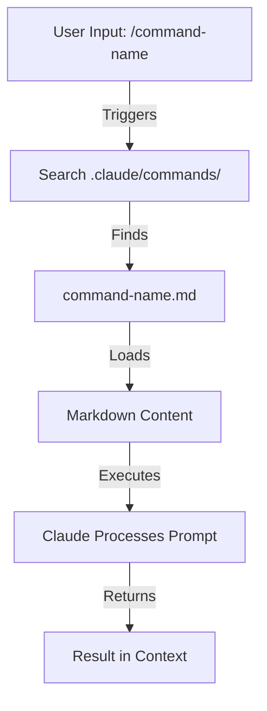

### File Structure

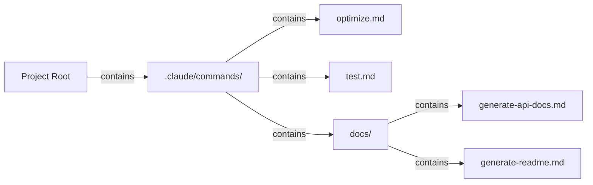

### Command Organization Table

| Location | Scope | Availability | Use Case | Git Tracked |
|----------|-------|--------------|----------|-------------|
| `.claude/commands/` | Project-specific | Team members | Team workflows, shared standards | ✅ Yes |
| `~/.claude/commands/` | Personal | Individual user | Personal shortcuts across projects | ❌ No |
| Subdirectories | Namespaced | Based on parent | Organize by category | ✅ Yes |

### Features & Capabilities

| Feature | Example | Supported |
|---------|---------|-----------|
| Shell script execution | `bash scripts/deploy.sh` | ✅ Yes |
| File references | `@path/to/file.js` | ✅ Yes |
| Bash integration | `$(git log --oneline)` | ✅ Yes |
| Arguments | `/pr --verbose` | ✅ Yes |
| MCP commands | `/mcp__github__list_prs` | ✅ Yes |

### Practical Examples

Eight copy-paste command templates live in **[01-slash-commands/](01-slash-commands/)** — `/optimize`, `/pr`, `/commit`, `/push-all`, `/generate-api-docs`, `/doc-refactor`, `/setup-ci-cd`, and `/unit-test-expand`.

**[01-slash-commands/README.md](01-slash-commands/README.md)** also carries the full built-in command reference (60+ commands) and the frontmatter field table.

### Command Lifecycle Diagram

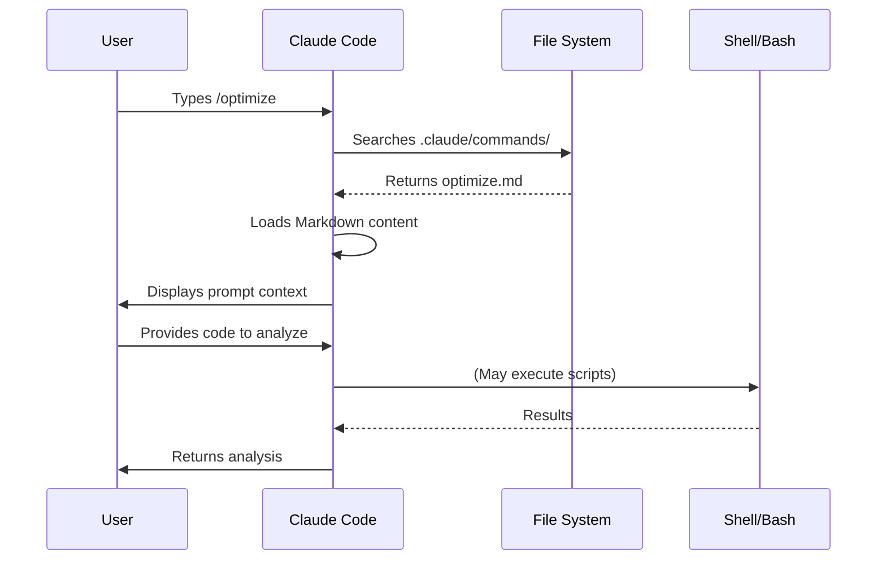

### Best Practices

| ✅ Do | ❌ Don't |
|------|---------|
| Use clear, action-oriented names | Create commands for one-time tasks |
| Document trigger words in description | Build complex logic in commands |
| Keep commands focused on single task | Create redundant commands |
| Version control project commands | Hardcode sensitive information |
| Organize in subdirectories | Create long lists of commands |
| Use simple, readable prompts | Use abbreviated or cryptic wording |

---

## Subagents

### Overview

Subagents are specialized AI assistants with isolated context windows and customized system prompts. They enable delegated task execution while maintaining clean separation of concerns.

Subagents can spawn their own subagents, **nested on by default up to depth 3 (v2.1.219)** — so the hierarchy is not limited to the single main → subagent layer shown below. Set `CLAUDE_CODE_MAX_SUBAGENT_SPAWN_DEPTH` to change the limit, or `1` to turn nesting off. (History: v2.1.172–v2.1.216 nested by default up to 5 layers with no way to change it; v2.1.217 made nesting opt-in at depth 1; v2.1.219 set the default to 3.)

### Architecture Diagram

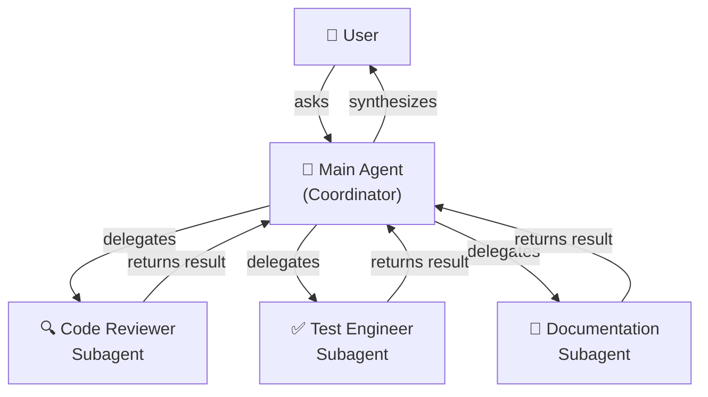

### Subagent Lifecycle

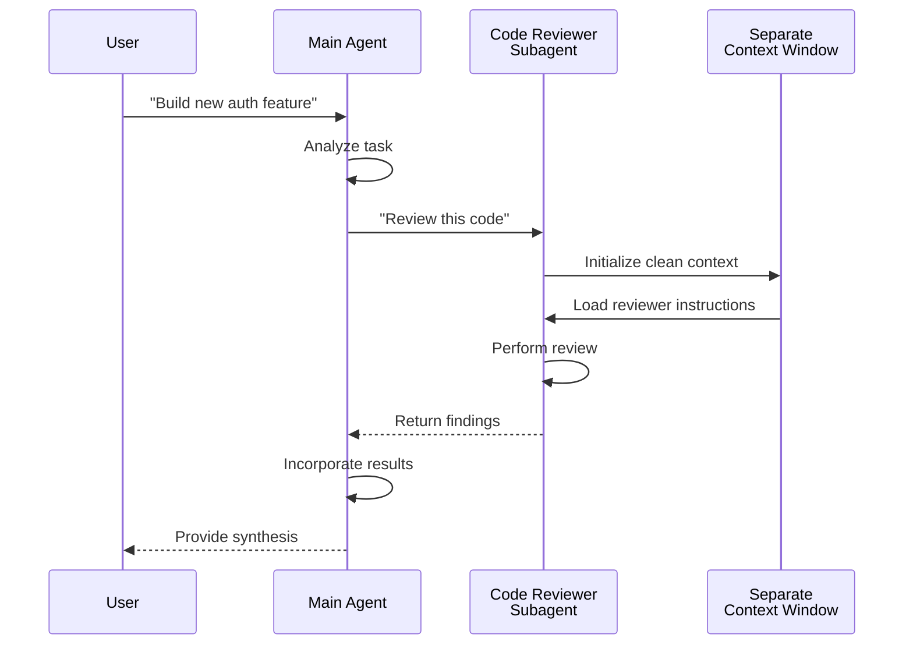

### Subagent Configuration Table

| Configuration | Type | Purpose | Example |
|---------------|------|---------|---------|
| `name` | String | Agent identifier | `code-reviewer` |
| `description` | String | Purpose & trigger terms | `Comprehensive code quality analysis` |
| `tools` | List/String | Allowed capabilities | `read, grep, diff, lint_runner` |
| `system_prompt` | Markdown | Behavioral instructions | Custom guidelines |

### Tool Access Hierarchy

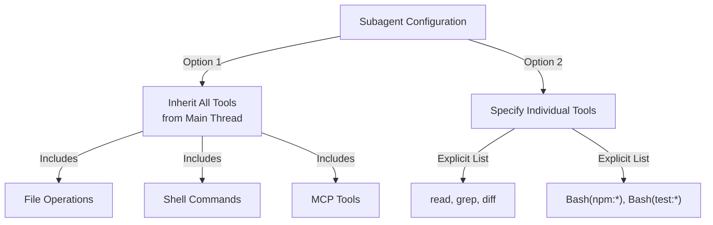

### Practical Examples

Nine ready-to-use subagent definitions live in **[04-subagents/](04-subagents/)** — `code-reviewer`, `clean-code-reviewer`, `secure-reviewer`, `test-engineer`, `documentation-writer`, `implementation-agent`, `performance-optimizer`, `debugger`, and `data-scientist`.

**[04-subagents/README.md](04-subagents/README.md)** documents the complete frontmatter reference, tool-access rules, nesting limits, and Agent Teams.

### Subagent Context Management

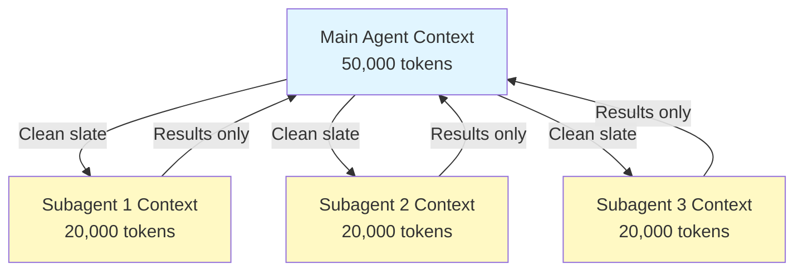

### When to Use Subagents

| Scenario | Use Subagent | Why |
|----------|--------------|-----|
| Complex feature with many steps | ✅ Yes | Separate concerns, prevent context pollution |
| Quick code review | ❌ No | Not necessary overhead |
| Parallel task execution | ✅ Yes | Each subagent has own context |
| Specialized expertise needed | ✅ Yes | Custom system prompts |
| Long-running analysis | ✅ Yes | Prevents main context exhaustion |
| Single task | ❌ No | Adds latency unnecessarily |

### Agent Teams

Agent Teams coordinate multiple agents working on related tasks. Rather than delegating to one subagent at a time, Agent Teams allow the main agent to orchestrate a group of agents that collaborate, share intermediate results, and work toward a common goal. This is useful for large-scale tasks like full-stack feature development where a frontend agent, backend agent, and testing agent work in parallel.

---

## Memory

### Overview

Memory enables Claude to retain context across sessions and conversations. It exists in two forms: automatic synthesis in claude.ai, and filesystem-based CLAUDE.md in Claude Code.

### Memory Architecture

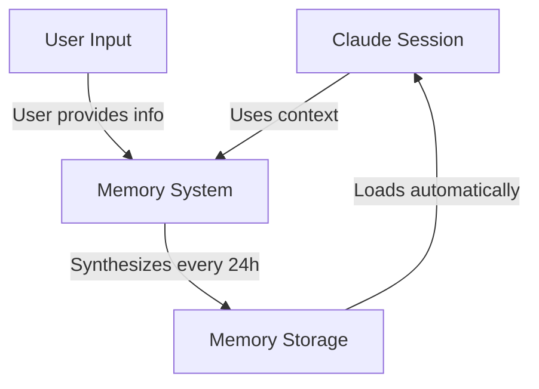

### Memory Hierarchy in Claude Code (7 Tiers)

Claude Code loads memory from 7 tiers, listed from highest to lowest priority:

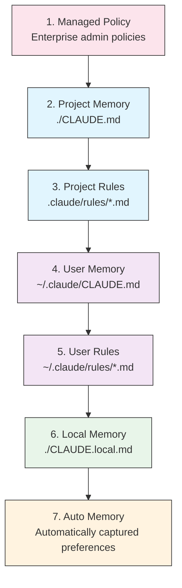

### Memory Locations Table

| Tier | Location | Scope | Priority | Shared | Best For |
|------|----------|-------|----------|--------|----------|
| 1. Managed Policy | Enterprise admin | Organization | Highest | All org users | Compliance, security policies |
| 2. Project | `./CLAUDE.md` | Project | High | Team (Git) | Team standards, architecture |
| 3. Project Rules | `.claude/rules/*.md` | Project | High | Team (Git) | Modular project conventions |
| 4. User | `~/.claude/CLAUDE.md` | Personal | Medium | Individual | Personal preferences |
| 5. User Rules | `~/.claude/rules/*.md` | Personal | Medium | Individual | Personal rule modules |
| 6. Local | `./CLAUDE.local.md` | Local | Low | Not shared | Machine-specific settings |
| 7. Auto Memory | Automatic | Session | Lowest | Individual | Learned preferences, patterns |

### Auto Memory

Auto Memory automatically captures user preferences and patterns observed during sessions. Claude learns from your interactions and remembers:

- Coding style preferences
- Common corrections you make
- Framework and tool choices
- Communication style preferences

Auto Memory works in the background and does not require manual configuration.

### Memory Update Lifecycle

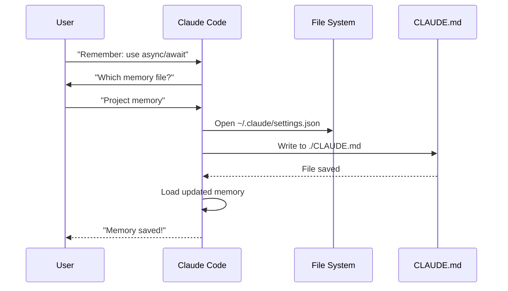

### Practical Examples

Copy-paste memory templates live in **[02-memory/](02-memory/)**:

- **`project-CLAUDE.md`** — team-wide project standards for `./CLAUDE.md`
- **`personal-CLAUDE.md`** — individual preferences for `~/.claude/CLAUDE.md`
- **`directory-api-CLAUDE.md`** — directory-scoped standards for a subtree

**[02-memory/README.md](02-memory/README.md)** covers the full hierarchy, import syntax, `.claude/rules/`, auto memory, and how to keep CLAUDE.md under 200 lines.

### Memory in Claude Web/Desktop

#### Memory Synthesis Timeline

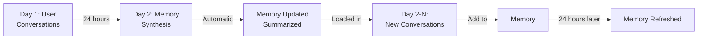

### Auto Memory Contents

Auto memory stores what Claude learns about you across sessions in `~/.claude/projects/<project>/memory/`, indexed by `MEMORY.md`. See **[02-memory/README.md](02-memory/README.md)** for the file layout, loading limits, and how to enable or disable it.

### Memory Features Comparison

| Feature | Claude Web/Desktop | Claude Code (CLAUDE.md) |
|---------|-------------------|------------------------|
| Auto-synthesis | ✅ Every 24h | ❌ Manual |
| Cross-project | ✅ Shared | ❌ Project-specific |
| Team access | ✅ Shared projects | ✅ Git-tracked |
| Searchable | ✅ Built-in | ✅ Through `/memory` |
| Editable | ✅ In-chat | ✅ Direct file edit |
| Import/Export | ✅ Yes | ✅ Copy/paste |
| Persistent | ✅ 24h+ | ✅ Indefinite |

---

## MCP Protocol

### Overview

MCP (Model Context Protocol) is a standardized way for Claude to access external tools, APIs, and real-time data sources. Unlike Memory, MCP provides live access to changing data.

### MCP Architecture

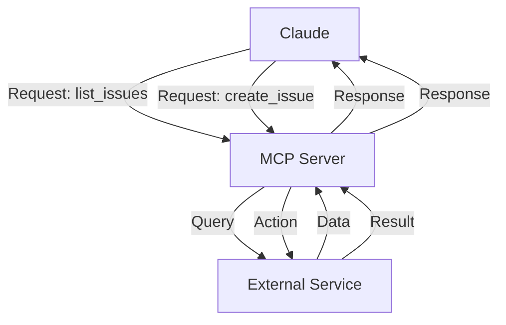

### MCP Ecosystem

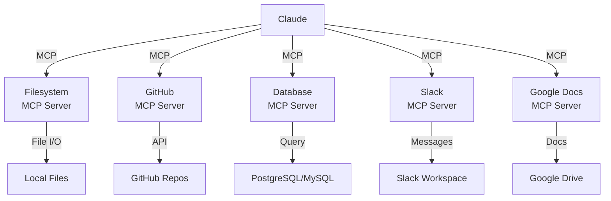

### MCP Setup Process

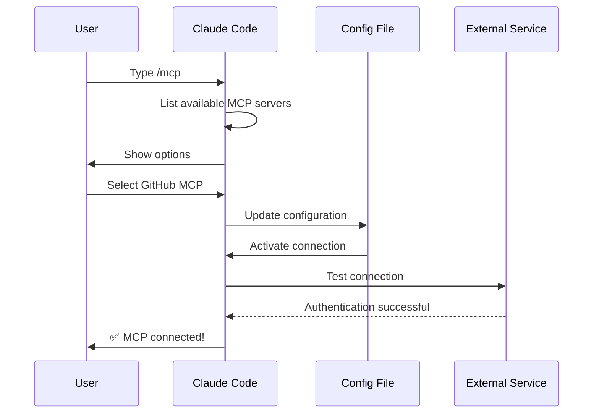

### Available MCP Servers Table

| MCP Server | Purpose | Common Tools | Auth | Real-time |
|------------|---------|--------------|------|-----------|
| **Filesystem** | File operations | read, write, delete | OS permissions | ✅ Yes |
| **GitHub** | Repository management | list_prs, create_issue, push | OAuth | ✅ Yes |
| **Slack** | Team communication | send_message, list_channels | Token | ✅ Yes |
| **Database** | SQL queries | query, insert, update | Credentials | ✅ Yes |
| **Google Docs** | Document access | read, write, share | OAuth | ✅ Yes |
| **Asana** | Project management | create_task, update_status | API Key | ✅ Yes |
| **Stripe** | Payment data | list_charges, create_invoice | API Key | ✅ Yes |
| **Memory** | Persistent memory | store, retrieve, delete | Local | ❌ No |

### Practical Examples

Ready-to-use MCP server configurations live in **[05-mcp/](05-mcp/)**: `github-mcp.json`, `database-mcp.json`, `filesystem-mcp.json`, and `multi-mcp.json` (four servers in one file).

**[05-mcp/README.md](05-mcp/README.md)** covers the full `claude mcp add` syntax, transports, scopes, OAuth, and enterprise allowlisting.

### MCP vs Memory: Decision Matrix

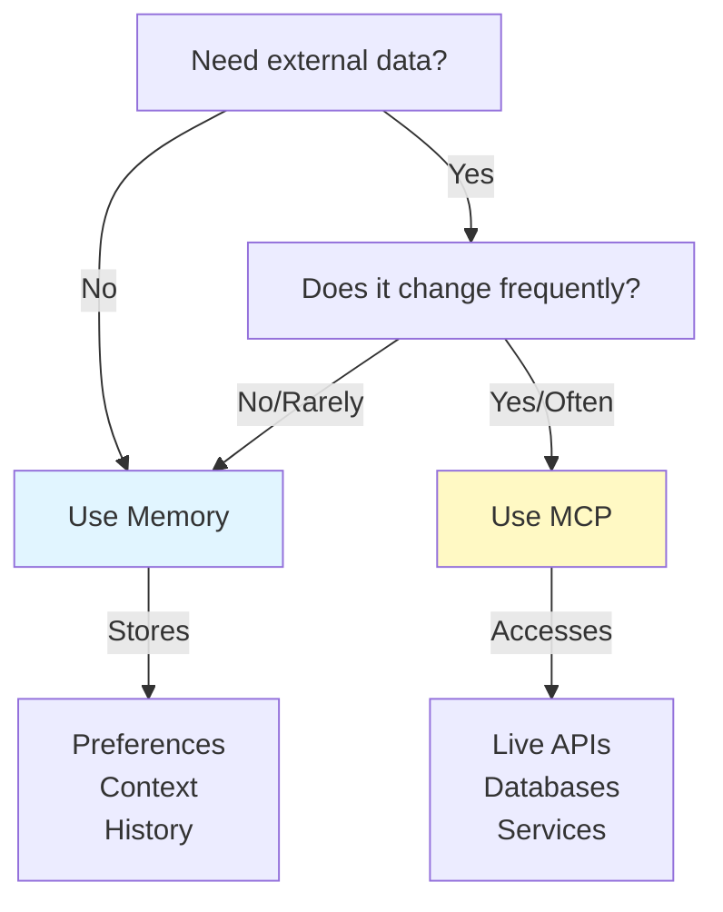

### Request/Response Pattern

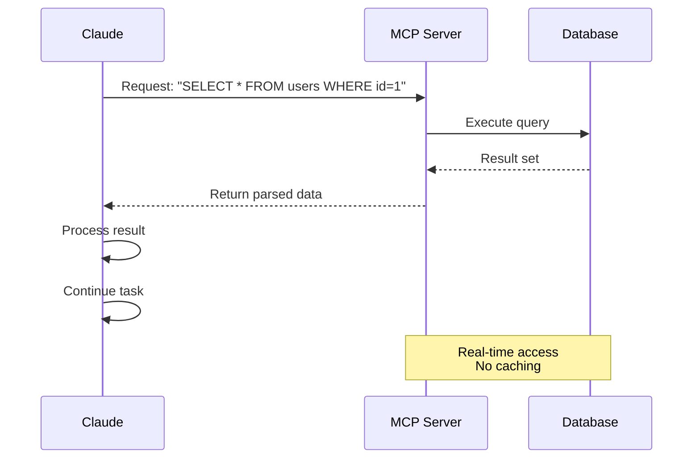

---

## Agent Skills

### Overview

Agent Skills are reusable, model-invoked capabilities packaged as folders containing instructions, scripts, and resources. Claude automatically detects and uses relevant skills.

### Skill Architecture

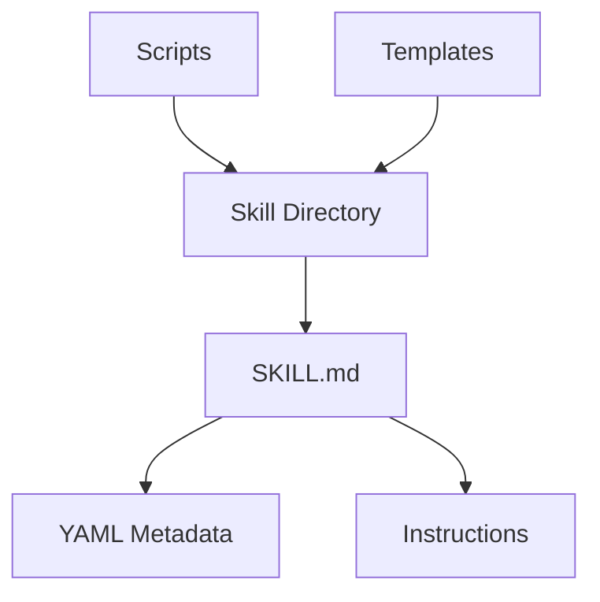

### Skill Loading Process

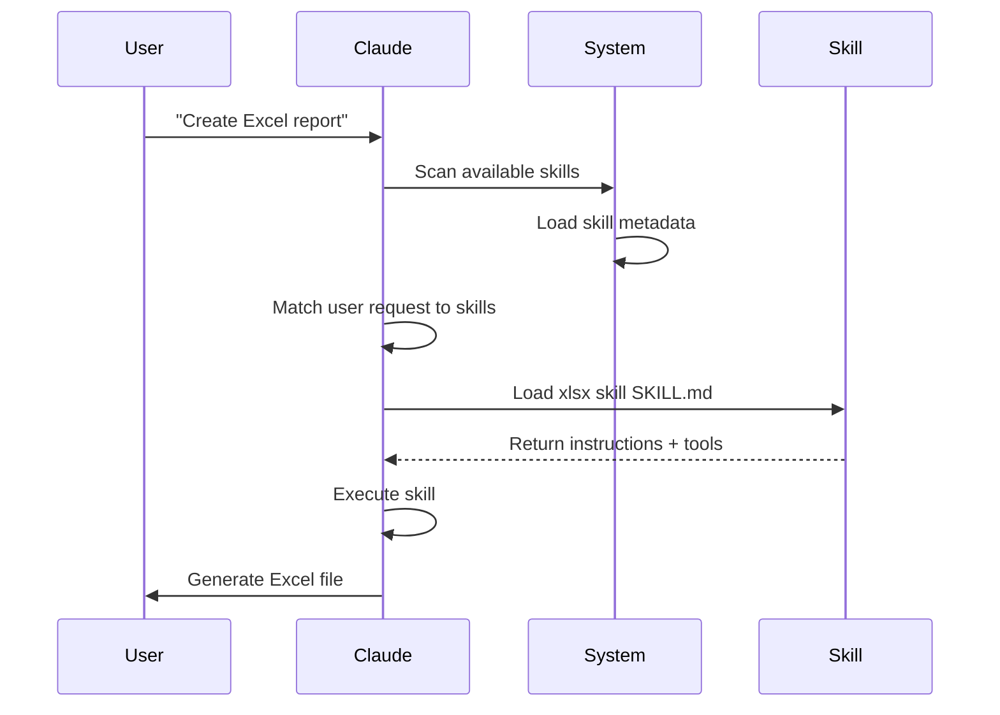

### Skill Types & Locations Table

| Type | Location | Scope | Shared | Sync | Best For |
|------|----------|-------|--------|------|----------|
| Pre-built | Built-in | Global | All users | Auto | Document creation |
| Personal | `~/.claude/skills/` | Individual | No | Manual | Personal automation |
| Project | `.claude/skills/` | Team | Yes | Git | Team standards |
| Plugin | Via plugin install | Varies | Depends | Auto | Integrated features |

### Pre-built Skills

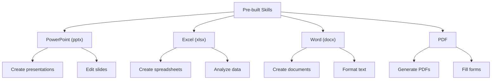

### Bundled Skills

Claude Code now includes 10 bundled skills available out of the box:

| Skill | Command | Purpose |
|-------|---------|---------|
| **Batch** | `/batch` | Run operations across multiple files or items |
| **Claude API** | `/claude-api` | Interact with the Anthropic API directly |
| **Code Review** | `/code-review` | Review the current diff for correctness bugs at a chosen effort level. A distinct skill from `/simplify` (quality/reuse cleanups), which was split back out in v2.1.154. Explicit invocation only since v2.1.215 |
| **Simplify** | `/simplify` | Quality, reuse, and cleanup review — distinct from `/code-review` again since v2.1.154 |
| **Debug** | `/debug` | Systematic debugging of issues with root cause analysis |
| **Fewer Permission Prompts** | `/fewer-permission-prompts` | Scan transcripts and propose a prioritized allowlist for common read-only tools |
| **Loop** | `/loop` | Schedule recurring tasks on a timer |
| **Run** | `/run` | Launch and drive the project's app to verify a change (v2.1.145+) |
| **Run Skill Generator** | `/run-skill-generator` | Scaffold a new skill from a description (v2.1.145+) |
| **Verify** | `/verify` | Verify that a change actually works (v2.1.145+). Explicit invocation only since v2.1.215 |

These bundled skills are always available and do not require installation or configuration.

### Practical Examples

Six complete skills — with their scripts, templates, and reference files — live in **[03-skills/](03-skills/)**:

- **`code-review-specialist/`** — review checklist, finding template, and two Python metrics scripts
- **`refactor/`** — code-smell catalog, refactoring catalog, plan template, and two analysis scripts
- **`doc-generator/`** — API documentation generation from source
- **`blog-draft/`** — outline and draft templates with a versioned output convention
- **`brand-voice/`** — tone rules and message templates (demonstrates `user-invocable: false`)
- **`claude-md/`** — create, update, and audit CLAUDE.md files

See **[03-skills/README.md](03-skills/README.md)** for the full frontmatter reference and progressive-disclosure model.

### Skill Discovery & Invocation

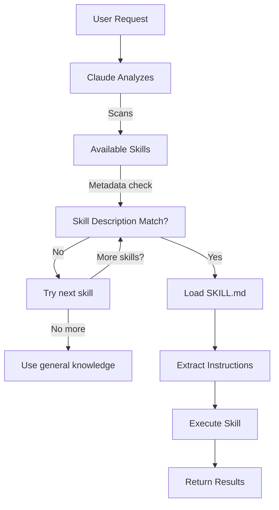

### Skill vs Other Features

```mermaid
graph TB
    A["Extending Claude"]
    B["Slash Commands"]
    C["Subagents"]
    D["Memory"]
    E["MCP"]
    F["Skills"]

    A --> B
    A --> C
    A --> D
    A --> E
    A --> F

    B -->|User-invoked| G["Quick shortcuts"]
    C -->|Auto-delegated| H["Isolated contexts"]
    D -->|Persistent| I["Cross-session context"]
    E -->|Real-time| J["External data access"]
    F -->|Auto-invoked| K["Autonomous execution"]
```

---

## Claude Code Plugins

### Overview

Claude Code Plugins are bundled collections of customizations (slash commands, subagents, MCP servers, and hooks) that install with a single command. They represent the highest-level extension mechanism—combining multiple features into cohesive, shareable packages.

### Architecture

```mermaid
graph TB
    A["Plugin"]
    B["Slash Commands"]
    C["Subagents"]
    D["MCP Servers"]
    E["Hooks"]
    F["Configuration"]

    A -->|bundles| B
    A -->|bundles| C
    A -->|bundles| D
    A -->|bundles| E
    A -->|bundles| F
```

### Plugin Loading Process

```mermaid
sequenceDiagram
    participant User
    participant Claude as Claude Code
    participant Plugin as Plugin Marketplace
    participant Install as Installation
    participant SlashCmds as Slash Commands
    participant Subagents
    participant MCPServers as MCP Servers
    participant Hooks
    participant Tools as Configured Tools

    User->>Claude: /plugin install pr-review
    Claude->>Plugin: Download plugin manifest
    Plugin-->>Claude: Return plugin definition
    Claude->>Install: Extract components
    Install->>SlashCmds: Configure
    Install->>Subagents: Configure
    Install->>MCPServers: Configure
    Install->>Hooks: Configure
    SlashCmds-->>Tools: Ready to use
    Subagents-->>Tools: Ready to use
    MCPServers-->>Tools: Ready to use
    Hooks-->>Tools: Ready to use
    Tools-->>Claude: Plugin installed ✅
```

### Plugin Types & Distribution

| Type | Scope | Shared | Authority | Examples |
|------|-------|--------|-----------|----------|
| Official | Global | All users | Anthropic | PR Review, Security Guidance |
| Community | Public | All users | Community | DevOps, Data Science |
| Organization | Internal | Team members | Company | Internal standards, tools |
| Personal | Individual | Single user | Developer | Custom workflows |

### Plugin Definition Structure

```yaml
---
name: plugin-name
version: "1.0.0"
description: "What this plugin does"
author: "Your Name"
license: MIT

# Plugin metadata
tags:
  - category
  - use-case

# Requirements
requires:
  - claude-code: ">=2.1.0"

# Components bundled
components:
  - type: commands
    path: commands/
  - type: agents
    path: agents/
  - type: mcp
    path: mcp/
  - type: hooks
    path: hooks/

# Configuration
config:
  auto_load: true
  enabled_by_default: true
---
```

### Plugin Structure

```
my-plugin/
├── .claude-plugin/
│   └── plugin.json
├── commands/
│   ├── task-1.md
│   ├── task-2.md
│   └── workflows/
├── agents/
│   ├── specialist-1.md
│   ├── specialist-2.md
│   └── configs/
├── skills/
│   ├── skill-1.md
│   └── skill-2.md
├── hooks/
│   └── hooks.json
├── .mcp.json
├── .lsp.json
├── settings.json
├── templates/
│   └── issue-template.md
├── scripts/
│   ├── helper-1.sh
│   └── helper-2.py
├── docs/
│   ├── README.md
│   └── USAGE.md
└── tests/
    └── plugin.test.js
```

### Practical Examples

Three complete, installable plugins live in **[07-plugins/](07-plugins/)**:

- **`pr-review/`** — review commands, three specialist agents, GitHub MCP, and a pre-review hook
- **`documentation/`** — doc generation commands, three agents, and reusable templates
- **`devops-automation/`** — deploy/rollback/status/incident commands, three agents, Kubernetes MCP, and shell scripts

Each includes its `.claude-plugin/plugin.json` manifest and directory layout.

### Plugin Marketplace

```mermaid
graph TB
    A["Plugin Marketplace"]
    B["Official<br/>Anthropic"]
    C["Community<br/>Marketplace"]
    D["Enterprise<br/>Registry"]

    A --> B
    A --> C
    A --> D

    B -->|Categories| B1["Development"]
    B -->|Categories| B2["DevOps"]
    B -->|Categories| B3["Documentation"]

    C -->|Search| C1["DevOps Automation"]
    C -->|Search| C2["Mobile Dev"]
    C -->|Search| C3["Data Science"]

    D -->|Internal| D1["Company Standards"]
    D -->|Internal| D2["Legacy Systems"]
    D -->|Internal| D3["Compliance"]
```

### Plugin Installation & Lifecycle

```mermaid
graph LR
    A["Discover"] -->|Browse| B["Marketplace"]
    B -->|Select| C["Plugin Page"]
    C -->|View| D["Components"]
    D -->|Install| E["/plugin install"]
    E -->|Extract| F["Configure"]
    F -->|Activate| G["Use"]
    G -->|Check| H["Update"]
    H -->|Available| G
    G -->|Done| I["Disable"]
    I -->|Later| J["Enable"]
    J -->|Back| G
```

### Plugin Features Comparison

| Feature | Slash Command | Skill | Subagent | Plugin |
|---------|---------------|-------|----------|--------|
| **Installation** | Manual copy | Manual copy | Manual config | One command |
| **Setup Time** | 5 minutes | 10 minutes | 15 minutes | 2 minutes |
| **Bundling** | Single file | Single file | Single file | Multiple |
| **Versioning** | Manual | Manual | Manual | Automatic |
| **Team Sharing** | Copy file | Copy file | Copy file | Install ID |
| **Updates** | Manual | Manual | Manual | Auto-available |
| **Dependencies** | None | None | None | May include |
| **Marketplace** | No | No | No | Yes |
| **Distribution** | Repository | Repository | Repository | Marketplace |

### Plugin Use Cases

| Use Case | Recommendation | Why |
|----------|-----------------|-----|
| **Team Onboarding** | ✅ Use Plugin | Instant setup, all configurations |
| **Framework Setup** | ✅ Use Plugin | Bundles framework-specific commands |
| **Enterprise Standards** | ✅ Use Plugin | Central distribution, version control |
| **Quick Task Automation** | ❌ Use Command | Overkill complexity |
| **Single Domain Expertise** | ❌ Use Skill | Too heavy, use skill instead |
| **Specialized Analysis** | ❌ Use Subagent | Create manually or use skill |
| **Live Data Access** | ❌ Use MCP | Standalone, don't bundle |

### When to Create a Plugin

```mermaid
graph TD
    A["Should I create a plugin?"]
    A -->|Need multiple components| B{"Multiple commands<br/>or subagents<br/>or MCPs?"}
    B -->|Yes| C["✅ Create Plugin"]
    B -->|No| D["Use Individual Feature"]
    A -->|Team workflow| E{"Share with<br/>team?"}
    E -->|Yes| C
    E -->|No| F["Keep as Local Setup"]
    A -->|Complex setup| G{"Needs auto<br/>configuration?"}
    G -->|Yes| C
    G -->|No| D
```

### Publishing a Plugin

**Steps to publish:**

1. Create plugin structure with all components
2. Write `.claude-plugin/plugin.json` manifest
3. Create `README.md` with documentation
4. Test locally with `/plugin install ./my-plugin`
5. Submit to plugin marketplace
6. Get reviewed and approved
7. Published on marketplace
8. Users can install with one command

### Example Plugin README

See the three complete plugins in **[07-plugins/](07-plugins/)** — `pr-review/`, `documentation/`, and `devops-automation/` each ship a full `README.md`, manifest, commands, agents, and MCP config you can copy wholesale.

### Plugin vs Manual Configuration

**Manual Setup (2+ hours):**
- Install slash commands one by one
- Create subagents individually
- Configure MCPs separately
- Set up hooks manually
- Document everything
- Share with team (hope they configure correctly)

**With Plugin (2 minutes):**
```bash
/plugin install pr-review
# ✅ Everything installed and configured
# ✅ Ready to use immediately
# ✅ Team can reproduce exact setup
```

---

## Comparison & Integration

### Feature Comparison Matrix

| Feature | Invocation | Persistence | Scope | Use Case |
|---------|-----------|------------|-------|----------|
| **Slash Commands** | Manual (`/cmd`) | Session only | Single command | Quick shortcuts |
| **Subagents** | Auto-delegated | Isolated context | Specialized task | Task distribution |
| **Memory** | Auto-loaded | Cross-session | User/team context | Long-term learning |
| **MCP Protocol** | Auto-queried | Real-time external | Live data access | Dynamic information |
| **Skills** | Auto-invoked | Filesystem-based | Reusable expertise | Automated workflows |

### Interaction Timeline

```mermaid
graph LR
    A["Session Start"] -->|Load| B["Memory (CLAUDE.md)"]
    B -->|Discover| C["Available Skills"]
    C -->|Register| D["Slash Commands"]
    D -->|Connect| E["MCP Servers"]
    E -->|Ready| F["User Interaction"]

    F -->|Type /cmd| G["Slash Command"]
    F -->|Request| H["Skill Auto-Invoke"]
    F -->|Query| I["MCP Data"]
    F -->|Complex task| J["Delegate to Subagent"]

    G -->|Uses| B
    H -->|Uses| B
    I -->|Uses| B
    J -->|Uses| B
```

### Practical Integration Example: Customer Support Automation

#### Architecture

```mermaid
graph TB
    User["Customer Email"] -->|Receives| Router["Support Router"]

    Router -->|Analyze| Memory["Memory<br/>Customer history"]
    Router -->|Lookup| MCP1["MCP: Customer DB<br/>Previous tickets"]
    Router -->|Check| MCP2["MCP: Slack<br/>Team status"]

    Router -->|Route Complex| Sub1["Subagent: Tech Support<br/>Context: Technical issues"]
    Router -->|Route Simple| Sub2["Subagent: Billing<br/>Context: Payment issues"]
    Router -->|Route Urgent| Sub3["Subagent: Escalation<br/>Context: Priority handling"]

    Sub1 -->|Format| Skill1["Skill: Response Generator<br/>Brand voice maintained"]
    Sub2 -->|Format| Skill2["Skill: Response Generator"]
    Sub3 -->|Format| Skill3["Skill: Response Generator"]

    Skill1 -->|Generate| Output["Formatted Response"]
    Skill2 -->|Generate| Output
    Skill3 -->|Generate| Output

    Output -->|Post| MCP3["MCP: Slack<br/>Notify team"]
    Output -->|Send| Reply["Customer Reply"]
```

#### Request Flow

```markdown
## Customer Support Request Flow

### 1. Incoming Email
"I'm getting error 500 when trying to upload files. This is blocking my workflow!"

### 2. Memory Lookup
- Loads CLAUDE.md with support standards
- Checks customer history: VIP customer, 3rd incident this month

### 3. MCP Queries
- GitHub MCP: List open issues (finds related bug report)
- Database MCP: Check system status (no outages reported)
- Slack MCP: Check if engineering is aware

### 4. Skill Detection & Loading
- Request matches "Technical Support" skill
- Loads support response template from Skill

### 5. Subagent Delegation
- Routes to Tech Support Subagent
- Provides context: customer history, error details, known issues
- Subagent has full access to: read, bash, grep tools

### 6. Subagent Processing
Tech Support Subagent:
- Searches codebase for 500 error in file upload
- Finds recent change in commit 8f4a2c
- Creates workaround documentation

### 7. Skill Execution
Response Generator Skill:
- Uses Brand Voice guidelines
- Formats response with empathy
- Includes workaround steps
- Links to related documentation

### 8. MCP Output
- Posts update to #support Slack channel
- Tags engineering team
- Updates ticket in Jira MCP

### 9. Response
Customer receives:
- Empathetic acknowledgment
- Explanation of cause
- Immediate workaround
- Timeline for permanent fix
- Link to related issues
```

### Complete Feature Orchestration

```mermaid
sequenceDiagram
    participant User
    participant Claude as Claude Code
    participant Memory as Memory<br/>CLAUDE.md
    participant MCP as MCP Servers
    participant Skills as Skills
    participant SubAgent as Subagents

    User->>Claude: Request: "Build auth system"
    Claude->>Memory: Load project standards
    Memory-->>Claude: Auth standards, team practices
    Claude->>MCP: Query GitHub for similar implementations
    MCP-->>Claude: Code examples, best practices
    Claude->>Skills: Detect matching Skills
    Skills-->>Claude: Security Review Skill + Testing Skill
    Claude->>SubAgent: Delegate implementation
    SubAgent->>SubAgent: Build feature
    Claude->>Skills: Apply Security Review Skill
    Skills-->>Claude: Security checklist results
    Claude->>SubAgent: Delegate testing
    SubAgent-->>Claude: Test results
    Claude->>User: Complete system delivered
```

### When to Use Each Feature

```mermaid
graph TD
    A["New Task"] --> B{Type of Task?}

    B -->|Repeated workflow| C["Slash Command"]
    B -->|Need real-time data| D["MCP Protocol"]
    B -->|Remember for next time| E["Memory"]
    B -->|Specialized subtask| F["Subagent"]
    B -->|Domain-specific work| G["Skill"]

    C --> C1["✅ Team shortcut"]
    D --> D1["✅ Live API access"]
    E --> E1["✅ Persistent context"]
    F --> F1["✅ Parallel execution"]
    G --> G1["✅ Auto-invoked expertise"]
```

### Selection Decision Tree

```mermaid
graph TD
    Start["Need to extend Claude?"]

    Start -->|Quick repeated task| A{"Manual or Auto?"}
    A -->|Manual| B["Slash Command"]
    A -->|Auto| C["Skill"]

    Start -->|Need external data| D{"Real-time?"}
    D -->|Yes| E["MCP Protocol"]
    D -->|No/Cross-session| F["Memory"]

    Start -->|Complex project| G{"Multiple roles?"}
    G -->|Yes| H["Subagents"]
    G -->|No| I["Skills + Memory"]

    Start -->|Long-term context| J["Memory"]
    Start -->|Team workflow| K["Slash Command +<br/>Memory"]
    Start -->|Full automation| L["Skills +<br/>Subagents +<br/>MCP"]
```

---

## Summary Table

| Aspect | Slash Commands | Subagents | Memory | MCP | Skills | Plugins |
|--------|---|---|---|---|---|---|
| **Setup Difficulty** | Easy | Medium | Easy | Medium | Medium | Easy |
| **Learning Curve** | Low | Medium | Low | Medium | Medium | Low |
| **Team Benefit** | High | High | Medium | High | High | Very High |
| **Automation Level** | Low | High | Medium | High | High | Very High |
| **Context Management** | Single-session | Isolated | Persistent | Real-time | Persistent | All features |
| **Maintenance Burden** | Low | Medium | Low | Medium | Medium | Low |
| **Scalability** | Good | Excellent | Good | Excellent | Excellent | Excellent |
| **Shareability** | Fair | Fair | Good | Good | Good | Excellent |
| **Versioning** | Manual | Manual | Manual | Manual | Manual | Automatic |
| **Installation** | Manual copy | Manual config | N/A | Manual config | Manual copy | One command |

---

## Quick Start Guide

### Week 1: Start Simple
- Create 2-3 slash commands for common tasks
- Enable Memory in Settings
- Document team standards in CLAUDE.md

### Week 2: Add Real-time Access
- Set up 1 MCP (GitHub or Database)
- Use `/mcp` to configure
- Query live data in your workflows

### Week 3: Distribute Work
- Create first Subagent for specific role
- Use `/agents` command
- Test delegation with simple task

### Week 4: Automate Everything
- Create first Skill for repeated automation
- Use Skill marketplace or build custom
- Combine all features for full workflow

### Ongoing
- Review and update Memory monthly
- Add new Skills as patterns emerge
- Optimize MCP queries
- Refine Subagent prompts

---

## Hooks

### Overview

Hooks are event-driven shell commands that execute automatically in response to Claude Code events. They enable automation, validation, and custom workflows without manual intervention.

### Hook Events

Claude Code supports **33 hook events** across five hook types (command, http, mcp_tool, prompt, agent):

| Hook Event | Trigger | Use Cases |
|------------|---------|-----------|
| **SessionStart** | Session begins/resumes/clear/compact | Environment setup, initialization |
| **Setup** | Initial environment setup (one-time per session) | Provision tooling, install deps |
| **InstructionsLoaded** | CLAUDE.md or rules file loaded | Validation, transformation, augmentation |
| **UserPromptSubmit** | User submits prompt | Input validation, prompt filtering |
| **UserPromptExpansion** | User prompt expanded (@-mentions, slash commands resolved) | Transform or inspect expanded prompt |
| **PreToolUse** | Before any tool runs | Validation, approval gates, logging |
| **PermissionRequest** | Permission dialog shown | Auto-approve/deny flows |
| **PermissionDenied** | User denies a permission prompt | Logging, analytics, policy enforcement |
| **PostToolUse** | After tool succeeds | Auto-formatting, notifications, cleanup |
| **PostToolUseFailure** | Tool execution fails | Error handling, logging |
| **PostToolBatch** | After a batch of tool uses completes | Aggregate reporting, batched validation |
| **Notification** | Notification sent | Alerting, external integrations |
| **MessageDisplay** | While assistant message text is displayed | Transform or hide displayed message text |
| **SubagentStart** | Subagent spawned | Context injection, initialization |
| **SubagentStop** | Subagent finishes | Result validation, logging |
| **Stop** | Claude finishes responding | Summary generation, cleanup tasks |
| **StopFailure** | API error ends turn | Error recovery, logging |
| **TeammateIdle** | Agent team teammate idle | Work distribution, coordination |
| **TaskCompleted** | Task marked complete. Only fires when the todo tools are enabled — off by default on Opus 4.8, Sonnet 5, Fable 5, Mythos 5, and newer models; `CLAUDE_CODE_ENABLE_TODO_TOOLS=1` restores them (v2.1.233) | Post-task processing |
| **TaskCreated** | Task created via TaskCreate. Only fires when the todo tools are enabled — off by default on Opus 4.8, Sonnet 5, Fable 5, Mythos 5, and newer models; `CLAUDE_CODE_ENABLE_TODO_TOOLS=1` restores them (v2.1.233) | Task tracking, logging |
| **ConfigChange** | Config file changes | Validation, propagation |
| **CwdChanged** | Working directory changes | Directory-specific setup |
| **DirectoryAdded** | New working directory registered mid-session via `/add-dir` or the SDK `register_repo_root` control request | Set up tooling for a newly added directory |
| **FileChanged** | Watched file changes | File monitoring, rebuild triggers |
| **PreCompact** | Before context compaction | State preservation |
| **PostCompact** | After compaction completes | Post-compact actions |
| **PreModelSwitch** | Before a requested model switch is applied | Gate or veto model changes |
| **PostModelSwitch** | After the session's model changes | Log or react to model changes |
| **WorktreeCreate** | Worktree being created | Environment setup, dependency install |
| **WorktreeRemove** | Worktree being removed | Cleanup, resource deallocation |
| **Elicitation** | MCP server requests user input | Input validation |
| **ElicitationResult** | User responds to elicitation | Response processing |
| **SessionEnd** | Session terminates | Cleanup, final logging |

### Common Hooks

Hooks are configured in `~/.claude/settings.json` (user-level) or `.claude/settings.json` (project-level):

```json
{
  "hooks": {
    "PostToolUse": [
      {
        "matcher": "Write",
        "hooks": [
          {
            "type": "command",
            "command": "prettier --write $CLAUDE_FILE_PATH"
          }
        ]
      }
    ],
    "PreToolUse": [
      {
        "matcher": "Edit",
        "hooks": [
          {
            "type": "command",
            "command": "eslint $CLAUDE_FILE_PATH"
          }
        ]
      }
    ]
  }
}
```

### Hook Environment Variables

- `$CLAUDE_FILE_PATH` - Path to file being edited/written
- `$CLAUDE_TOOL_NAME` - Name of tool being used
- `$CLAUDE_SESSION_ID` - Current session identifier
- `$CLAUDE_PROJECT_DIR` - Project directory path

### Best Practices

✅ **Do:**
- Keep hooks fast (< 1 second)
- Use hooks for validation and automation
- Handle errors gracefully
- Use absolute paths

❌ **Don't:**
- Make hooks interactive
- Use hooks for long-running tasks
- Hardcode credentials

**See**: [06-hooks/](06-hooks/) for detailed examples

---

## Checkpoints and Rewind

### Overview

Checkpoints allow you to save conversation state and rewind to previous points, enabling safe experimentation and exploration of multiple approaches.

### Key Concepts

| Concept | Description |
|---------|-------------|
| **Checkpoint** | Snapshot of conversation state including messages, files, and context |
| **Rewind** | Return to a previous checkpoint, discarding subsequent changes |
| **Branch Point** | Checkpoint from which multiple approaches are explored |

### Accessing Checkpoints

Checkpoints are created automatically with every user prompt. To rewind:

```bash
# Press Esc twice to open the checkpoint browser
Esc + Esc

# Or use the /rewind command
/rewind
```

When you select a checkpoint, you choose from five options:
1. **Restore code and conversation** -- Revert both to that point
2. **Restore conversation** -- Rewind messages, keep current code
3. **Restore code** -- Revert files, keep conversation
4. **Summarize from here** -- Compress conversation into a summary
5. **Never mind** -- Cancel

### Use Cases

| Scenario | Workflow |
|----------|----------|
| **Exploring Approaches** | Save → Try A → Save → Rewind → Try B → Compare |
| **Safe Refactoring** | Save → Refactor → Test → If fail: Rewind |
| **A/B Testing** | Save → Design A → Save → Rewind → Design B → Compare |
| **Mistake Recovery** | Notice issue → Rewind to last good state |

### Configuration

```json
{
  "autoCheckpoint": true
}
```

**See**: [08-checkpoints/](08-checkpoints/) for detailed examples

---

## Advanced Features

### Planning Mode

Create detailed implementation plans before coding.

**Activation:**
```bash
/plan Implement user authentication system
```

**Benefits:**
- Clear roadmap with time estimates
- Risk assessment
- Systematic task breakdown
- Opportunity for review and modification

### Extended Thinking

Deep reasoning for complex problems.

**Activation:**
- Toggle with `Alt+T` (or `Option+T` on macOS) during a session
- Set `MAX_THINKING_TOKENS` environment variable for programmatic control

```bash
# Enable extended thinking via environment variable
export MAX_THINKING_TOKENS=50000
claude -p "Should we use microservices or monolith?"
```

**Benefits:**
- Thorough analysis of trade-offs
- Better architectural decisions
- Consideration of edge cases
- Systematic evaluation

### Background Tasks

Run long operations without blocking the conversation.

**Usage:**
```bash
User: Run tests in background

Claude: Started task bg-1234

/task list           # Show all tasks
/task status bg-1234 # Check progress
/task show bg-1234   # View output
/task cancel bg-1234 # Cancel task
```

### Permission Modes

Control what Claude can do.

| Mode | Description | Use Case |
|------|-------------|----------|
| **manual** | Standard permissions with prompts for sensitive actions (renamed from `default` in v2.1.200; `default` still works as an alias) | General development |
| **acceptEdits** | Automatically accept file edits without confirmation | Trusted editing workflows |
| **plan** | Analysis and planning only, no file modifications | Code review, architecture planning |
| **auto** | Automatically approve safe actions, prompt only for risky ones | Balanced autonomy with safety |
| **dontAsk** | Execute all actions without confirmation prompts | Experienced users, automation |
| **bypassPermissions** | Full unrestricted access, no safety checks | CI/CD pipelines, trusted scripts |

**Usage:**
```bash
claude --permission-mode plan          # Read-only analysis
claude --permission-mode acceptEdits   # Auto-accept edits
claude --permission-mode auto          # Auto-approve safe actions
claude --permission-mode dontAsk       # No confirmation prompts
```

### Headless Mode (Print Mode)

Run Claude Code without interactive input for automation and CI/CD using the `-p` (print) flag.

**Usage:**
```bash
# Run specific task
claude -p "Run all tests"

# Pipe input for analysis
cat error.log | claude -p "explain this error"

# CI/CD integration (GitHub Actions)
- name: AI Code Review
  run: claude -p "Review PR changes and report issues"

# JSON output for scripting
claude -p --output-format json "list all functions in src/"
```

### Scheduled Tasks

Run tasks on a repeating schedule using the `/loop` command.

**Usage:**
```bash
/loop every 30m "Run tests and report failures"
/loop every 2h "Check for dependency updates"
/loop every 1d "Generate daily summary of code changes"
```

Scheduled tasks run in the background and report results when complete. They are useful for continuous monitoring, periodic checks, and automated maintenance workflows.

### Chrome Integration

Claude Code can integrate with the Chrome browser for web automation tasks. This enables capabilities like navigating web pages, filling forms, taking screenshots, and extracting data from websites directly within your development workflow.

### Session Management

Manage multiple work sessions.

**Commands:**
```bash
/resume                # Resume a previous conversation
/rename "Feature"      # Name the current session
/fork                  # Fork into a new session
claude -c              # Continue most recent conversation
claude -r "Feature"    # Resume session by name/ID
```

### Interactive Features

**Keyboard Shortcuts:**
- `Ctrl + R` - Search command history
- `Tab` - Autocomplete
- `↑ / ↓` - Command history
- `Ctrl + L` - Clear screen

**Multi-line Input:**
```bash
User: \
> Long complex prompt
> spanning multiple lines
> \end
```

### Configuration

Complete configuration example:

```json
{
  "planning": {
    "autoEnter": true,
    "requireApproval": true
  },
  "extendedThinking": {
    "enabled": true,
    "showThinkingProcess": true
  },
  "permissions": {
    "defaultMode": "manual"
  }
}
```

There is no `settings.json` block for background tasks — the feature is controlled by the `CLAUDE_CODE_DISABLE_BACKGROUND_TASKS` environment variable, and concurrency by `CLAUDE_CODE_MAX_CONCURRENT_SUBAGENTS` (default `20`).

**See**: [09-advanced-features/](09-advanced-features/) for comprehensive guide

---

## Models and Reasoning Effort

Claude Code supports the following models with adaptive reasoning effort:

| Model | Context Window | Effort Levels | Default Effort (Claude Code) |
|-------|----------------|---------------|------------------------------|
| Claude Opus 5 | 1M tokens (native) | `low`, `medium`, `high`, `xhigh`, `max` | `high` — default Opus model since v2.1.219 (requires Claude Code v2.1.219+) |
| Claude Sonnet 5 | 1M tokens (native) | `low`, `medium`, `high`, `xhigh`, `max` | `high` — default model for Pro/Team Standard/Enterprise since v2.1.197 |
| Claude Opus 4.8 | 1M tokens (native) | `low`, `medium`, `high`, `xhigh`, `max` | `high` (since v2.1.154) |
| Claude Opus 4.7 (legacy) | 1M tokens (native) | `low`, `medium`, `high`, `xhigh`, `max` | `xhigh` (since Opus 4.7 launch, 2026-04-16) |
| Claude Sonnet 4.6 | 1M tokens | `low`, `medium`, `high`, `max` | `high` for Pro/Max subscribers (raised from `medium` in v2.1.117) |
| Claude Haiku 4.5 | 200K tokens | — (no effort support) | — |

> **Note**: `xhigh` is available on Opus 5, Sonnet 5, Opus 4.8, and Opus 4.7; `max` works on Opus 5, Sonnet 5, Opus 4.8/4.7/4.6 and Sonnet 4.6 (session-only). Haiku 4.5 does not support effort levels.

> **Note**: v2.1.117 fixed a bug where Opus 4.7 sessions computed `/context` against 200K instead of the native 1M window — upgrade to v2.1.117 or later to actually get the 1M context on Opus 4.7. Opus 5 and Opus 4.8 also have a native 1M-token window.

> **Note**: `/cost` and `/stats` merged into `/usage` in v2.1.118. `/usage` is now the canonical command with tabs for cost/stats/etc.; `/cost` and `/stats` remain as shortcut aliases that open the corresponding tab. As of v2.1.149, the cost view also breaks spending down by category (skills, subagents, plugins, and per-MCP-server costs).

## Resources

- [Claude Code Documentation](https://code.claude.com/docs/en/overview)
- [Claude Code Changelog](https://code.claude.com/docs/en/changelog)
- [MCP GitHub Servers](https://github.com/modelcontextprotocol/servers)
- [Anthropic Cookbook](https://github.com/anthropics/anthropic-cookbook)

---
**Last Updated**: September 2, 2026
**Claude Code Version**: 2.1.257
**Sources**:
- https://www.anthropic.com/news/claude-sonnet-5
- https://code.claude.com/docs/en/cli-reference
- https://code.claude.com/docs/en/model-config
- https://github.com/anthropics/claude-code/blob/main/CHANGELOG.md
- https://code.claude.com/docs/en/hooks
**Compatible Models**: Claude Fable 5.1, Claude Fable 5, Claude Opus 5, Claude Sonnet 5, Claude Sonnet 4.6, Claude Opus 4.8, Claude Haiku 4.5
